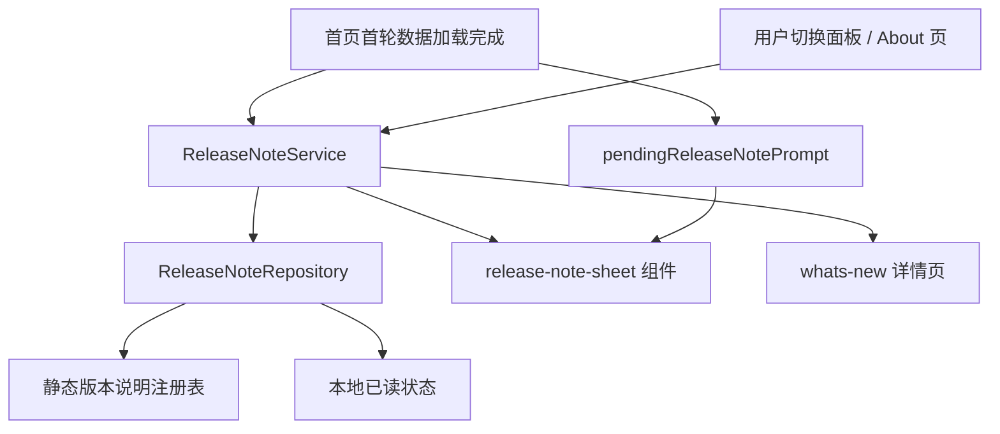

# 里程碑-22P：版本变化感知与更新说明体验

> **设计状态**：✅ 已完成（已交付并完成回归与文档同步）
> **创建日期**：2026-05-19
> **设计者**：GPT5 Codex
> **审核者**：项目维护者
> **预计工期**：2-3天

> **实施结果（2026-05-19）**
> - 已完成 `ReleaseNote` 模型、仓储、服务、运行时版本工具与静态发布说明注册表
> - 已完成首页一次性轻提醒、帮助入口 badge、About 稳定入口与 `whats-new` 详情页
> - 已完成 child / parent / viewer 视角受众过滤、按 `currentUser + version` 的提示/已读状态，以及定向测试与文档同步

---

## 📋 目录

- [需求分析](#需求分析)
- [技术方案](#技术方案)
- [代码结构](#代码结构)
- [实施步骤](#实施步骤)
- [测试方案](#测试方案)
- [风险评估](#风险评估)
- [替代方案](#替代方案)

---

## 需求分析

### 功能描述

当前小程序每次新增功能发布后，真实用户通常只能“偶然发现变化”，缺少一个正式、稳定、低打扰的“这次更新了什么”感知能力。现有产品虽然已经有首页、消息中心、用户切换面板、About 页和帮助入口，但这些入口分别承担任务管理、事件提醒、身份切换和帮助反馈语义，尚未正式承接“版本变化说明”。

本期目标是在不破坏现有高级、极简、易理解视觉调性的前提下，建立一个轻量的版本变化感知方案：让用户在新版本首次进入时获得一次克制提醒，在需要时可以查看“本次更新”详情，并能从帮助 / About 体系回看近期版本变化。该能力本期聚焦产品内静态内容与轻量已读状态，不扩展为后台运营系统。

### 业务价值

- [x] 用户价值：用户能明确知道“这次多了什么、值得我注意什么”，降低功能上线后的发现成本。
- [x] 产品价值：提升版本迭代的感知度，让已交付的体验优化真正被用户看到和理解。
- [x] 技术价值：建立标准化的版本更新说明结构、入口和一次性已读机制，为未来更正式的发布运营能力留出扩展点。

### 功能范围

**包含**：
- ✅ 新增“小程序内版本变化感知”独立里程碑设计
- ✅ 首页在新版本首次进入时展示一次轻量“本次更新”提示
- ✅ 新增“本次更新 / 新变化”详情承接页
- ✅ 在 About 页增加“本次更新”或“版本变化”入口，并保留历史回看
- ✅ 在用户切换面板的帮助入口上增加轻量未读提示能力
- ✅ 建立按版本存储的一次性提醒 / 已读状态
- ✅ 支持按当前视角用户裁剪版本说明内容（如全量、家长优先、孩子优先）

**不包含**：
- ❌ 不做全屏强制更新公告
- ❌ 不做后台 CMS、数据库配置和在线运营投放系统
- ❌ 不把版本变化作为消息中心主承载能力
- ❌ 不做逐功能 walkthrough、手把手分步引导或多页新手教程
- ❌ 不做 push、订阅消息或站外消息通知
- ❌ 不在本期覆盖 Android / iOS 原生更新能力，仅处理小程序内功能变化认知

### 优先级

- **优先级**：P1
- **理由**：这不是核心业务闭环阻塞项，但它直接影响版本迭代成果能否被用户感知，且可在不侵入核心任务流的前提下提升产品完成度。

---

## 技术方案

### 方案概述

本期采用“**首页一次轻提醒 + 帮助体系承接 + About 历史回看 + 本地轻状态**”方案。

核心原则：

1. **先让用户回到熟悉首页，再提示这次有新变化**
   - 仅在首页首轮关键数据加载完成后，再决定是否展示一次轻量 bottom sheet / 卡片式抽屉
   - 不在冷启动刚进入页面时立即强弹，避免遮挡主要任务内容

2. **把版本变化放在帮助 / 关于体系，而不是运行中消息流里**
   - “版本变化”属于产品认知层信息，不应和任务、奖励、系统事件消息长期混在同一信息流

3. **本期以静态内容 + 本地已读状态为主**
   - 版本说明内容由前端静态配置提供
   - 已读 / 已提示状态通过本地存储记录
   - 不新增后端接口，不引入系统管理员在线发布能力

4. **信息密度克制**
   - 每次版本只强调 1 条摘要和最多 3 条核心变化
   - 采用“你现在可以……”的用户视角文案，而不是技术 changelog 原文搬运

### 核心设计决策

#### 决策1：首次提醒采用轻量底部卡片，不采用强制全屏弹窗

首页首次提醒采用轻量 bottom sheet 或卡片式抽屉，展示内容仅包含：

- 版本标题（如“本次更新”）
- 一句摘要
- 最多 2-3 条变化预览
- 两个动作：`稍后查看`、`查看详情`

选择理由：

- 与当前首页信息架构兼容，不抢主任务
- 更符合项目现有克制、轻卡片、非强运营的视觉调性
- 允许用户知道“有变化”，但不被要求立刻完整阅读

#### 决策2：首次提醒必须等待首页关键数据稳定后再展示

“稳定后”的定义以首页现有加载编排为准，至少满足：

- 首轮页面批量数据加载已完成
- 当前首页已完成基础身份与任务内容渲染
- 当前未打开搜索面板、消息预览等更高优先级覆盖层

实现上建议在首页首轮 `loadAllPageData()` 完成之后，由独立模块先计算一次提示资格，并写入 `pendingReleaseNotePrompt`。后续在以下时机统一调用 `evaluateReleaseNotePromptDisplay()`：

- 首页首轮数据加载完成后
- 搜索面板关闭后
- 消息预览关闭后
- 首页 onboarding 卡片隐藏后
- 用户切换完成并刷新首页数据后

选择理由：

- 避免冷启动阶段闪动、跳位和认知负担
- 与首页现有 onboarding / 消息预览显示边界更容易协调
- 更接近“附加说明”，而非“阻断式打断”

#### 决策3：主承接页放在 About 体系，不把版本行本身改成唯一入口

About 页当前已经承担：

- 应用信息展示
- 版本信息展示
- 版本区域 7 连击进入系统管理员页

因此本期不直接重写“当前版本”这一行的语义，而是在 About 页新增独立的“本次更新 / 近期变化”入口卡片，点击进入版本变化详情页。

选择理由：

- 保留现有管理员隐藏入口，不破坏已有行为
- About 页天然适合承接帮助、版本和产品说明
- 可形成“帮助与反馈 → 本次更新 / 关于 → 历史回看”的稳定认知路径

#### 决策4：用户切换面板只做轻提示，帮助入口仍先进入 About 页

用户切换面板已有“帮助与反馈”次级入口。本期不在该面板内展开完整更新说明，仅在帮助入口上增加轻量 badge，例如：

- `有新变化`
- `NEW`

点击后仍先进入 About 页，由 About 页中的独立“本次更新 / 近期变化”入口再进入版本变化详情页。

选择理由：

- 该面板本质是身份切换和次级动作入口，不适合塞入长内容
- 轻 badge 足以让用户感知“最近有更新”
- 保持“帮助与反馈”入口的原始语义，不把支持入口直接劫持为更新详情页
- 能复用现有帮助入口深度，不额外增加首页常驻按钮

#### 决策5：版本说明内容本期采用静态配置注册表

本期引入前端静态版本说明注册表，按版本维护：

```javascript
{
  version: '3.10.0',
  publishedAt: '2026-05-19',
  title: '本次更新',
  summary: '现在可以更清楚地知道每次新增了什么',
  audiences: ['all'],
  highlights: [
    {
      id: 'home-help-entry',
      kind: 'improved',
      title: '帮助入口更好找了',
      summary: '从首页头像打开面板后，可以更快进入帮助与反馈页'
    }
  ]
}
```

选择理由：

- 本期主要是产品说明能力，不值得先引入后台配置链路
- 可保证设计、文案、前端呈现一次性收口
- 后续若确有频繁发布说明运营需求，再升级为服务端配置

#### 决策6：可见性、未读和已读状态统一按当前视角用户记录

本期版本说明是否可见、是否未读、是否已提示过，统一按当前视角用户 `currentUser.userId + version` 记录，而不是仅按 `loginUser` 记录。

选择理由：

- 本期已经明确支持按受众裁剪内容；如果仍按 `loginUser` 记忆，会与“当前视角可见性”产生冲突
- 在本项目里“视角用户”本身就是正式产品语义，家长切孩子视角时看到的内容应与该视角一致
- 这可以避免“家长看过一次后，孩子视角永远不再提示”或相反的状态错位
#### 决策7：首次提醒采用“待展示状态 + 多入口复检”，但不做二次自动提醒

首页在首轮数据加载完成后，不是立即“一次判断后结束”，而是进入一个轻量待展示状态：

- 若当前无搜索面板、消息预览、首页 onboarding 卡片等覆盖层，则立即展示
- 若当前有覆盖层，则保留 `pendingReleaseNotePrompt` 状态
- 当相关覆盖层关闭时，再次执行 `evaluateReleaseNotePromptDisplay()`
- 用户一旦点击 `稍后查看` 或 `查看详情`，就清除该待展示状态；本版本后续不再自动二次提醒

选择理由：

- 解决首次判断时正好被覆盖层占用导致“本轮再也不出现”的问题
- 与“不做二次提醒”的产品要求一致：待展示只在当前进入链路内重试，用户明确关闭后不再自动弹
- 可以和首页既有 `showSearch / showMessagePreview / showHomeOnboardingCard` 显隐编排自然协作

#### 决策8：历史回看只保留近期版本，不做无限 changelog 列表

版本变化详情页建议展示：

1. 当前版本“本次更新”
2. 最近若干历史版本摘要（如最近 3-5 个版本）

不做长篇全量 changelog 列表，不展示技术实现细节。

选择理由：

- 保持极简，避免 About 体系被版本文本淹没
- 用户更关心“最近有什么变化”，不是完整工程履历
- 与当前产品气质更一致

### 交互设计

#### 1. 首页首次提醒

触发条件：

- 当前运行版本存在匹配的版本说明配置
- 当前视角用户尚未看过该版本说明
- 首页首轮关键数据加载完成
- 当前未显示更高优先级覆盖层

展示形式：

- 从底部轻滑入的悬浮卡片
- 不超过屏幕高度的 40%
- 背后仍能看到首页

交互动作：

- `稍后查看`
  - 关闭卡片
  - 记录本版本已提示过，不再自动弹出
  - 保留 About / 帮助入口未读提示
- `查看详情`
  - 关闭卡片并跳转详情页
  - 标记该版本已读

#### 2. 帮助入口提示

用户切换面板中已有“帮助与反馈”入口，本期增加轻量 badge：

- 有未读版本变化时显示 badge
- 已读后去除 badge
- 帮助入口点击后仍先进入 About 页

视觉原则：

- badge 不能喧宾夺主
- 优先沿用 About 页浅蓝强调色
- 不使用高饱和警示红

#### 3. About 页承接

About 页增加独立的“本次更新”区块或信息行：

- 当前有未读内容时，显示版本号和 `新变化` 标记
- 无未读时，也允许用户主动进入查看近期变化
- 帮助联系方式仍保留在 About 页主信息区，不因为有更新说明而被隐藏

同时保留：

- 当前版本信息
- 运行环境信息
- 版本区域 7 连击管理员入口

#### 4. 版本变化详情页

页面信息架构建议：

1. Hero 摘要
   - 当前版本号
   - 一句变化摘要
2. 核心变化卡片
   - 最多 3 条
   - 每条包含：类别、标题、简述、可选去往入口
3. 近期历史版本
   - 最近 3-5 个版本简要摘要

文案原则：

- 标题强调用户收益，如“现在可以更快找到帮助入口”
- 避免工程词汇堆积，如“重构”“治理”“链路收口”

### 技术选型

| 技术点 | 选择方案 | 替代方案 | 选择理由 |
|--------|---------|---------|---------|
| 版本说明内容源 | 前端静态注册表 | 后端 CMS / DB 表 | 本期需求明确、变更频率低，静态配置风险更小 |
| 提醒触发时机 | 首页首轮数据稳定后进入“待展示状态”，覆盖层关闭后复检 | 冷启动即弹 / 每次进入都弹 | 避免打断主任务，又避免首次判断被覆盖层吞掉 |
| 已读状态存储 | 本地轻量状态存储（按 `currentUser + version`） | 服务端同步已读状态 | 本期先保证当前视角一致性，复杂度更低 |
| 主入口承接 | About / 帮助体系 | 消息中心 | 语义更匹配“产品说明”而非“事件消息” |
| 首次提醒容器 | 独立轻量组件 | 直接在首页 WXML 内拼装 | 便于复用与隔离复杂度 |
| 版本解析 | 共享运行时版本解析 helper | 各页面各自手写回退逻辑 | 保证 About 页与版本说明匹配口径一致 |

### DDD分层设计

**领域层（models/）**：
- [x] 新建模型：`models/release-note.js`
- [ ] 修改模型：无
- 说明：定义版本说明实体、受众匹配、摘要高亮结构和基础校验逻辑。

**服务层（services/）**：
- [x] 新建服务：`services/release-note-service.js`
- [ ] 修改服务：`services/service-manager.js`
- 说明：负责解析当前版本说明、判断是否需要首次提醒、标记提示/已读、向表现层提供列表和详情数据。

**仓储层（repositories/）**：
- [x] 新建仓储：`repositories/release-note-repository.js`
- [ ] 修改仓储：无
- 说明：负责读取静态版本说明注册表，以及读写本地“已提示/已读”状态。

**适配器层（adapters/）**：
- [ ] 新建适配器：无
- [ ] 修改适配器：无
- 说明：本期复用现有存储适配能力，不新增独立适配器。

**表现层（pages/、components/）**：
- [x] 新建页面：`packageManage/pages/whats-new/`
- [x] 新建组件：`components/release-note-sheet/`
- [ ] 修改页面：`pages/index/`、`packageManage/pages/about/`
- [ ] 修改组件：`components/user-switcher/`
- 说明：首页负责触发首次提醒和 badge 状态计算，用户切换面板仅负责轻提示展示，About 页负责稳定入口，详情页负责正式阅读和历史回看。

### 架构图



### 数据模型

```typescript
type ReleaseAudience = 'all' | 'parent' | 'child' | 'viewer' | 'manager';
type ReleaseHighlightKind = 'new' | 'improved' | 'fixed';

interface ReleaseNoteHighlight {
  id: string;
  kind: ReleaseHighlightKind;
  title: string;
  summary: string;
  actionLabel?: string;
  actionPath?: string;
}

interface ReleaseNote {
  version: string;
  publishedAt: string;
  title: string;
  summary: string;
  audiences: ReleaseAudience[];
  highlights: ReleaseNoteHighlight[];
}

interface ReleaseNoteReadState {
  version: string;
  effectiveUserId: string;
  promptShownAt?: number;
  readAt?: number;
}
```

### 接口设计

**新增服务接口**：

| 方法 | 说明 | 参数 | 返回值 |
|------|------|------|--------|
| `getCurrentReleaseNote(context)` | 获取当前版本对当前视角用户可见的说明 | `{ loginUser, currentUser, runtimeVersion }` | `{ success, note, unread, promptEligible }` |
| `listVisibleReleaseNotes(context)` | 获取当前视角用户可见的近期版本说明 | `{ loginUser, currentUser }` | `{ success, notes }` |
| `markPromptShown(version, effectiveUserId)` | 标记当前视角用户已弹过首次提醒 | `{ version, effectiveUserId }` | `{ success }` |
| `markReleaseNoteRead(version, effectiveUserId)` | 标记当前视角用户已读 | `{ version, effectiveUserId }` | `{ success }` |
| `getHelpEntryBadgeState(context)` | 获取帮助入口 badge 状态 | `{ loginUser, currentUser, runtimeVersion }` | `{ visible, text }` |
| `evaluateReleaseNotePromptDisplay(pageState, context)` | 判断当前是否可以真正显示首次提醒 | `{ showSearch, showMessagePreview, showHomeOnboardingCard }` | `{ shouldDisplay, pending }` |

---

## 代码结构

### 文件变更清单

**新增文件**：
- `models/release-note.js` - 版本说明领域模型与校验
- `repositories/release-note-repository.js` - 静态注册表 + 本地已读状态访问
- `services/release-note-service.js` - 版本说明解析、已读状态和提示资格判断
- `utils/runtime-version.js` - 统一运行时版本解析与 `0.0.0` 回退规则
- `utils/release-notes/index.js` - 当前版本与近期历史版本静态说明配置
- `components/release-note-sheet/` - 首页轻提醒组件
- `packageManage/pages/whats-new/` - 本次更新 / 近期变化详情页
- `test/models/release-note.test.js` - 模型校验测试
- `test/repositories/release-note-repository.test.js` - 仓储与本地状态测试
- `test/services/release-note-service.test.js` - 业务判断测试
- `test/components/release-note-sheet.test.js` - 组件行为测试
- `test/pages/whats-new.page.test.js` - 详情页测试

**修改文件**：
- `services/service-manager.js` - 注入 `ReleaseNoteService`
- `pages/index/index.js` - 接入首页首次提醒编排
- `pages/index/index.wxml` - 挂载轻提醒组件
- `pages/index/index.wxss` - 适配组件层级和安全区
- `pages/index/modules/` - 视实现拆出 `index-release-note.js`
- `components/user-switcher/user-switcher.js` - 新增 badge 展示属性，保持纯展示组件职责
- `components/user-switcher/user-switcher.wxml` - 展示 `有新变化` 提示
- `components/user-switcher/user-switcher.wxss` - 帮助入口 badge 样式
- `packageManage/pages/about/about.js` - 增加版本变化入口数据
- `packageManage/pages/about/about.wxml` - 增加“本次更新 / 近期变化”区块
- `packageManage/pages/about/about.wxss` - 延续 About 卡片视觉风格
- `test/pages/about.page.test.js` - 补充新入口和旧管理员入口共存测试
- `test/pages/index.page-shell.behavior.test.js` - 补充首次提醒触发和延迟逻辑测试

### 核心代码结构

```javascript
class ReleaseNoteService {
  constructor({ repository, appMeta }) {
    this.repository = repository;
    this.appMeta = appMeta;
  }

  async getCurrentReleaseNote(context) {
    const runtimeVersion = context.runtimeVersion || this.appMeta.version;
    const note = await this.repository.findByVersion(runtimeVersion);
    if (!note || !this._matchesAudience(note, context)) {
      return { success: true, note: null, unread: false, promptEligible: false };
    }

    const effectiveUserId = this._getEffectiveUserId(context.currentUser);
    const state = await this.repository.getReadState(runtimeVersion, effectiveUserId);
    return {
      success: true,
      note,
      unread: !state.readAt,
      promptEligible: !state.promptShownAt && !state.readAt
    };
  }

  async markPromptShown(version, effectiveUserId) {
    return this.repository.saveReadState(version, effectiveUserId, {
      promptShownAt: Date.now()
    });
  }

  async markReleaseNoteRead(version, effectiveUserId) {
    return this.repository.saveReadState(version, effectiveUserId, {
      promptShownAt: Date.now(),
      readAt: Date.now()
    });
  }

  evaluateReleaseNotePromptDisplay(pageState = {}) {
    const blocked = pageState.showSearch || pageState.showMessagePreview || pageState.showHomeOnboardingCard;
    return {
      shouldDisplay: !blocked,
      pending: blocked
    };
  }
}
```

### 关键函数

**函数1**：`maybeShowReleaseNotePrompt`
- **输入**：`{ loginUser, currentUser, runtimeVersion }`
- **输出**：是否展示首页首次提醒
- **职责**：在首页首轮数据稳定后写入或消费 `pendingReleaseNotePrompt`，判断是否需要展示“本次更新”卡片
- **依赖**：`ReleaseNoteService`、首页覆盖层状态

**函数2**：`getHelpEntryBadgeState`
- **输入**：用户上下文与当前版本
- **输出**：`{ visible, text }`
- **职责**：由页面层决定用户切换面板帮助入口是否显示轻量更新提示
- **依赖**：`ReleaseNoteService`

**函数3**：`buildVisibleReleaseNotes`
- **输入**：版本说明列表、用户上下文
- **输出**：可见说明列表
- **职责**：根据受众和版本过滤当前用户可见的版本说明
- **依赖**：`ReleaseNote` 模型

---

## 实施步骤

### 第1步：建立版本说明数据层（预计4小时）

- [ ] **任务**：新增 `ReleaseNote` 模型、仓储和静态版本说明注册表
- [ ] **验证**：当前版本有说明时可正确取回；无说明时返回空结果
- [ ] **依赖**：现有 `appMeta.version`、存储适配能力

**实施要点**：
1. 版本说明结构必须稳定，避免页面层自己拼字段
2. 本地已读状态要与版本号解耦存储，支持多版本历史
3. 受众过滤逻辑统一收口到模型 / 服务层，并明确按 `currentUser` 视角判断

---

### 第2步：建立服务层与首页提醒判定（预计6小时）

- [ ] **任务**：新增 `ReleaseNoteService` 并接入 `ServiceManager`，完成首页首次提醒资格判断
- [ ] **验证**：首次进入匹配版本时会触发一次提醒；关闭后不再重复自动弹出
- [ ] **依赖**：首页现有首轮数据加载编排

**实施要点**：
1. 首页只负责时机编排，不直接判断业务规则
2. 提醒时机必须晚于首轮数据稳定
3. 若搜索 / 消息预览 / onboarding 抢占显示，则保留 `pendingReleaseNotePrompt` 并在覆盖层关闭时复检

---

### 第3步：接入帮助入口、About 页与详情页（预计8小时）

- [ ] **任务**：新增详情页，修改用户切换面板与 About 页入口
- [ ] **验证**：帮助入口可见 badge；About 页可进入详情；版本 7 连击管理员入口不受影响
- [ ] **依赖**：第1步和第2步完成

**实施要点**：
1. About 页新增独立入口，不复写“当前版本”行主语义
2. 用户切换面板的“帮助与反馈”入口保持先进入 About，不直接改成更新详情页
3. 详情页视觉延续现有 About 卡片样式，不做重运营化设计
4. 首页卡片点击“查看详情”后应标记已读；仅进入 About 页不自动算已读

---

### 第4步：测试与视觉收口（预计4小时）

- [ ] **任务**：补齐模型、服务、页面和组件测试，并收口视觉细节
- [ ] **验证**：定向测试通过，关键手工路径通过
- [ ] **依赖**：前3步完成

**实施要点**：
1. 重点回归首页首页壳层、About 页、帮助入口
2. 确认不同角色和无说明版本不会误弹
3. 保证 badge、抽屉和详情页三处文案一致

---

## 测试方案

### 单元测试

| 测试项 | 测试方法 | 预期结果 |
|--------|---------|---------|
| `ReleaseNote` 模型校验 | 构造合法/非法版本说明数据 | 非法结构被拒绝，合法结构可正常实例化 |
| 受众过滤 | 输入 parent / child / viewer 上下文 | 仅返回当前受众可见内容 |
| 已读状态判断 | 模拟未提示、已提示、已读三种状态 | `promptEligible / unread` 判断正确 |
| 版本匹配 | 当前版本有说明 / 无说明 | 返回结果与配置一致 |
| 运行时版本回退 | 输入空版本、`0.0.0`、有效版本 | 与 About 页使用同一回退口径 |

### 集成测试

- [ ] 首页首轮加载完成后，若当前版本有未读说明，则展示一次轻提醒
- [ ] 首页首轮加载完成时若被 onboarding / 消息预览占用，覆盖层关闭后仍能展示一次轻提醒
- [ ] 用户点击 `稍后查看` 后，不再自动重复弹出，但帮助入口仍保留未读提示
- [ ] 用户点击 `查看详情` 后，跳转详情页并清除未读提示
- [ ] About 页新增入口后，现有版本 7 连击管理员入口仍可用
- [ ] 当前版本无说明时，首页、帮助入口和 About 页不应出现误提示
- [ ] 帮助入口点击后仍先进入 About 页；只有进入“本次更新”详情页后才算已读

### 手动测试

参考 `docs/development/coding_standards.md` 中的测试流程：

1. **功能测试**：
   - [ ] 家长首次进入新版本时，首页在数据稳定后出现轻提醒
   - [ ] 切换不同 `currentUser` 视角时，仅对当前视角可见的版本说明显示提示和未读态
   - [ ] 孩子 / viewer / 只读场景下，若受众可见，仍能通过帮助入口进入版本说明
   - [ ] About 页可以查看当前版本变化和近期历史变化
   - [ ] 首页卡片关闭、详情页返回后，不影响主任务流

2. **回归测试**：
   - [ ] 首页原有 onboarding 卡片、消息预览、搜索面板不受破坏
   - [ ] 用户切换面板帮助入口原有跳转不受影响
   - [ ] About 页联系方式、版本信息和管理员暗门逻辑不受影响

### 测试覆盖率目标

- 最低要求：85%
- 推荐目标：90%

---

## 风险评估

### 技术风险

| 风险项 | 影响 | 概率 | 应对措施 |
|--------|------|------|---------|
| 首页首次提醒与 onboarding / 消息预览冲突 | 高 | 中 | 将触发逻辑独立为 `maybeShowReleaseNotePrompt()`，统一检查覆盖层状态并延迟执行 |
| 版本说明静态配置漏填或版本号不匹配 | 中 | 中 | 增加测试校验当前版本与版本说明注册表关系；无匹配时安全降级为不展示 |
| 当前视角与已读状态维度不一致 | 高 | 中 | 明确以 `currentUser + version` 为唯一判断口径，禁止混用 `loginUser` 已读状态 |
| About 页新增入口破坏管理员隐藏入口 | 高 | 低 | About 页测试中保留并扩展现有“7 连击进入管理员页”验证 |
| 运行时版本解析与 About 页口径不一致 | 中 | 中 | 抽出共享版本解析 helper，统一处理空值与 `0.0.0` 回退 |

### 业务风险

| 风险项 | 影响 | 概率 | 应对措施 |
|--------|------|------|---------|
| 文案过技术化，用户仍然看不懂更新点 | 高 | 中 | 版本说明文案统一改写为用户收益视角，不直接搬运 changelog |
| 信息过多，反而增加打扰 | 高 | 中 | 每版最多 3 条核心变化，历史只保留近期版本摘要 |
| 入口太深，用户仍然不知道去哪看 | 中 | 中 | 首页首次轻提醒 + 用户切换面板帮助入口 badge + About 稳定入口三层承接 |
| 后续版本迭代时未持续维护版本说明 | 高 | 中 | 在实现方案中加入固定发布清单、静态注册表校验和“是否需要更新说明”的提交前检查 |

---

## 替代方案

### 方案A：每次新版本强制全屏弹窗

**描述**：
每次用户进入新版本时，全屏展示更新说明，必须手动关闭。

**不选择原因**：

- 打断性过强
- 与当前产品克制风格冲突
- 容易让用户把“版本变化”当成障碍而不是帮助

### 方案B：仅在消息中心投放系统消息

**描述**：
复用现有 `system` 消息类型，在消息中心放一条“版本更新说明”。

**不选择原因**：

- 语义不匹配，消息中心更偏运行时事件流
- 用户未必会主动进消息中心看产品变化
- 难以形成稳定“版本认知”入口

### 方案C：直接做后台可配置发布系统

**描述**：
新增后端表、系统管理员发布页、可动态编辑版本说明和受众。

**不选择原因**：

- 明显超出本期问题规模
- 会引入额外鉴权、接口、数据同步和测试负担
- 在真实使用还未证明高频发布运营需求前，性价比不高

### 方案D：仅在 About 页增加一个“更新日志”列表

**描述**：
不做首页提醒，只在 About 页增加历史版本文本列表。

**不选择原因**：

- 被动入口过深，用户依然很可能不知道“最近变了什么”
- 无法解决“发布了但用户没感知到”的核心问题
- 只能满足回看，不能满足首次发现

---

## 后续版本维护机制

### 单一数据源

后续每次版本变化说明的唯一内容源固定为：

- `utils/release-notes/index.js`

该文件负责维护：

- 当前版本说明
- 近期历史版本说明
- 每条说明的受众、摘要、高亮项和可选跳转入口

`CHANGELOG.md` 继续承担“已完成事实记录”，不直接作为前台展示源；前台版本说明内容也不从 `CHANGELOG.md` 自动解析生成，避免把工程记录原样暴露给用户。

### 发布内容编写约束

每个进入前台展示的版本说明必须满足以下规则：

1. 只写用户能感知的变化
   - 不写纯重构、纯测试、纯治理动作，除非用户体验因此明确改变
2. 只保留 1 条摘要和最多 3 条高亮
   - 避免把前台版本说明写成完整 changelog
3. 文案必须使用“用户收益表达”
   - 优先写“现在可以…… / 更容易…… / 更清楚……”
   - 禁止直接写“重构 / 收口 / 治理 / 链路优化”这类工程术语
4. 每条高亮必须可归类
   - `new`：新增能力
   - `improved`：体验优化
   - `fixed`：用户可感知问题修复

### 何时必须更新版本说明

后续任一版本开发完成后，只要满足以下任一条件，就必须评估并通常应更新版本说明：

- 新增了前台用户可直接使用的新功能
- 调整了已有入口、流程、页面结构或核心交互
- 修复了用户高频能感知的问题
- 改变了权限、身份、提示、空态、文案、导航等用户心智

以下情况通常不需要单独更新版本说明：

- 纯测试补齐
- 纯内部重构且前台无感知
- 仅文档同步
- 仅后端实现细节调整，且前台体验完全不变

### 发布前检查清单

后续每次准备发布带有用户可感知变化的版本时，实施者需要在提交前完成以下检查：

- [ ] 当前版本号是否已在 `utils/release-notes/index.js` 中登记
- [ ] 本次是否确实存在用户可感知变化
- [ ] 若存在，是否已编写摘要和最多 3 条高亮
- [ ] 文案是否已从工程语言改写为用户收益语言
- [ ] 受众是否正确按 `currentUser` 视角配置
- [ ] 可选跳转入口是否真实存在且不会失效
- [ ] `CHANGELOG.md` 是否同步记录了完成事实

### 防漏机制

为了避免后续版本忘记使用这套能力，本期实施时应同时补入以下约束：

1. 静态校验
   - 增加针对 `utils/release-notes/index.js` 的测试
   - 至少校验：版本号唯一、字段完整、`highlights.length <= 3`
2. 版本一致性校验
   - 若 `appMeta.version` 已变更，而版本说明注册表中不存在对应条目，测试应明确失败或至少发出强提醒
3. 设计与交付同步
   - 新里程碑完成后，在更新 `CHANGELOG.md` 时同步判断是否要更新版本说明注册表
4. 实施默认动作
   - 后续任何“面向真实用户的新功能 / 体验变更”任务，在设计评审时默认包含一句：`是否需要新增或更新版本说明`

### 推荐实施口径

为了让这项能力长期可持续，建议把它当作“发布工件”而不是“可选文案”：

- 代码实现是功能工件
- `CHANGELOG.md` 是工程记录工件
- `utils/release-notes/index.js` 是前台发布说明工件

三者职责分离，但必须同步维护。

---

## 实施完成后的文档同步要求

本里程碑实施完成后，除更新本设计文档状态外，还应按项目文档规范同步：

- `docs/development/CHANGELOG.md`
  - 记录 `M22P` 已完成事实、关键交付内容和验证结果
- `docs/api/services-guide.md`
  - 补充 `ReleaseNoteService` 对外职责、方法签名与返回结构
- `docs/api/repositories.md`
  - 补充 `ReleaseNoteRepository` 的职责、读写键模型与使用边界
- `docs/development/ROADMAP.md`
  - 将 `M22P` 从“设计中 / 实施中”翻转为“已完成”
