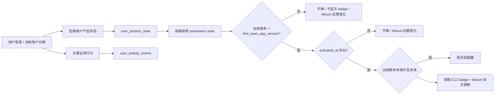

# 里程碑-22Q：版本提醒用户分层与产品状态权威化

> **设计状态**：🟢 审核通过（可实施）
> **创建日期**：2026-05-19
> **设计者**：GPT5 Codex
> **审核者**：项目维护者
> **预计工期**：2-3天

---

## 📋 目录

- [需求分析](#需求分析)
- [技术方案](#技术方案)
- [代码结构](#代码结构)
- [实施步骤](#实施步骤)
- [测试方案](#测试方案)
- [风险评估](#风险评估)
- [替代方案](#替代方案)

---

## 需求分析

### 功能描述

`M22P` 已建立“首页一次轻提醒 + 帮助入口 badge + About 稳定入口 + 近期变化详情页”的版本变化感知能力，但当前提醒资格仍基于前台本地状态和 `currentUser + version` 的轻量未读语义。这样虽然能满足基础体验，但无法稳定回答一个更产品化的问题：

“这个用户到底算不算升级用户，是否应该自动看到本次更新？”

在当前方案下，如果用户清理微信缓存、重装、换设备，或者共享设备上新增新的家庭成员，前台本地状态会丢失或失真，真实老用户会被误判为新用户，真实新用户也可能被错误归为升级用户。随着你希望在起步阶段就逐步把用户行为信息沉淀到数据库，用于后续后台分析和产品演进，`M22Q` 不应继续停留在“前台本地规则修补”层面，而应升级为：

1. 建立后端权威的用户产品状态  
2. 建立轻量关键行为事件底座  
3. 用这两层能力支撑版本提醒对“新用户 / 升级用户 / 已激活用户”的正式判断

### 业务价值

- [x] 用户价值：避免新用户首次进入被“本次更新”打断，也避免老用户因清缓存/换设备被重新当成新用户。
- [x] 产品价值：让版本提醒真正基于用户产品生命周期，而不是设备本地缓存状态。
- [x] 技术价值：建立可持续扩展的用户产品状态与关键行为事件底座，为后续后台分析、激活漏斗与体验治理提供事实基础。

### 功能范围

**包含**：
- ✅ 将版本提醒资格从前台本地判断升级为后端权威判断
- ✅ 新增用户产品状态模型，用于记录 `firstSeenVersion`、`activatedAt` 等关键状态
- ✅ 新增轻量关键行为事件表，用于沉淀未来后台分析可复用的最小事件事实
- ✅ 明确“新用户 / 升级用户 / 已激活用户”的正式产品定义
- ✅ 调整首页自动弹、帮助入口 badge、About 入口在不同用户阶段下的语义
- ✅ 设计前后端接口、数据库迁移、状态回填与测试方案

**不包含**：
- ❌ 不做全量点击埋点系统
- ❌ 不做通用审计后台或运营报表后台
- ❌ 不做复杂实时分析面板
- ❌ 不把本期扩成完整“用户行为分析平台”
- ❌ 不重做 `M22P` 的视觉结构与 `whats-new` 页面主体内容
- ❌ 不在本期引入 CMS 或在线版本说明运营配置

### 优先级

- **优先级**：P1
- **理由**：这不是主链路阻塞项，但会直接影响版本提醒语义的准确性，也为后续后台分析能力铺设正式地基，投入小于长期反复修补本地规则的成本。

---

## 技术方案

### 方案概述

`M22Q` 采用“**后端权威状态 + 轻量关键行为事件**”的组合方案。

这两层能力职责明确：

1. **用户产品状态（权威态）**
   - 直接服务前台在线判断
   - 明确这个用户首次接触产品时看到的版本
   - 明确这个用户是否已完成“有效使用激活”

2. **用户关键行为事件（分析底座）**
   - 记录少量关键业务事件
   - 为未来后台分析提供原始事实
   - 不承担前台实时提醒的直接决策职责

本期所有“用户产品状态”与“版本提醒资格”的归属对象，统一指向**当前业务视角用户**，也就是项目既有语义中的 `currentUser`，而不是设备登录身份 `loginUser`。这是因为：

- 版本提醒当前本来就是按 `currentUser + version` 维护前台已读/已提示状态
- 共享设备下家长切换孩子视角时，版本提醒的语义也应跟随当前业务视角，而不是只绑定设备登录者
- 后端判断必须继续复用现有家庭权限与系统权限模型，保证 `loginUser` 只能读取或写入自己有权操作的 `currentUser` 状态
- 现有后端已经广泛使用 `resolveTargetUserId(...)` 解析“当前登录者是否有权操作目标业务用户”，`M22Q` 应沿用这套真实机制，而不是新造一套独立权限模型

版本提醒最终规则调整为：

1. **基线用户**
   - 当前版本等于该用户 `first_seen_app_version`
   - 不自动弹提醒
   - 不显示帮助入口 badge
   - About 入口显示为中性语义 `近期变化`

2. **升级但未激活用户**
   - 当前版本高于 `first_seen_app_version`
   - 但 `activated_at` 为空
   - 仍不自动弹提醒
   - About 入口继续显示 `近期变化`
   - 目的：避免“看了一眼就走”的弱接触用户被版本提醒打断

3. **升级且已激活用户**
   - 当前版本高于 `first_seen_app_version`
   - 且 `activated_at` 不为空
   - 再进入既有 `M22P` 规则：首页数据稳定且无遮挡时，自动轻提醒一次
   - 帮助入口显示 badge，About 标题使用 `本次更新`

### 正式产品定义

#### 1. 基线用户

满足以下任一条件：

- 数据库中还没有该用户的 `user_product_state`，并在本次登录初始化时首次创建
- 当前运行版本等于该用户的 `first_seen_app_version`

正式语义：

- 这是该用户首次被系统正式识别到的产品版本基线
- 基线用户不应被自动弹出的“本次更新”打断

#### 2. 升级用户

满足以下条件：

- `compareVersion(runtimeVersion, first_seen_app_version) > 0`

正式语义：

- 该用户曾在更早的产品基线版本被正式识别过
- 现在进入的是更高版本，因此具备“版本变化”参照系

#### 3. 已激活用户

满足以下条件：

- `activated_at IS NOT NULL`

激活不是“看过页面”或“打开过首页”，而是至少建立过一条可证明其已开始真实使用产品的权威业务事实。建议激活来源按以下口径定义：

| 激活来源 | 是否计入激活 | 理由 |
|---------|-------------|------|
| 创建家庭 | 是 | 代表用户开始建立真实使用空间 |
| 加入家庭 | 是 | 代表用户已进入真实协作环境 |
| 创建任务 | 是 | 代表已进入核心任务主链路 |
| 创建奖励 | 是 | 代表已进入核心激励主链路 |
| 完成任务 | 是 | 代表已形成真实使用闭环 |
| 仅登录 / 仅停留首页 / 仅进入 About | 否 | 不能证明已开始有效使用 |

正式语义：

- 激活态是“这个用户已开始真实使用产品”的稳定判断
- 激活态一旦建立，不因客户端缓存清理、设备切换而回退

### 兼容与回填策略

`M22Q` 上线时，系统中已经存在一批历史用户。由于历史版本并未权威记录“首次看到产品的版本”，本期需要明确兼容策略，而不是假设历史真相可完整恢复。

建议策略如下：

1. **对新进入系统的用户**
   - 首次登录成功后，至少为 `loginUser` 自身创建或补建 `user_product_state`
   - 当家长设备后续切换到某个此前未建档的 `currentUser` 视角时，在首次读取该视角的产品状态时按需补建
   - 将当前运行版本写入 `first_seen_app_version`
   - 该版本就是该用户的正式产品基线

2. **对 `M22Q` 上线前已存在、且已有业务事实的历史用户**
   - 在迁移或首次登录触发补建时创建 `user_product_state`
   - `first_seen_app_version` 统一回填为 `M22Q` 上线版本
   - `activated_at` 优先回填为可获得的最早权威业务事实时间；若缺少可靠时间，则回填为迁移时间，并标记 `activation_source = 'migration_backfill'`

3. **对 `M22Q` 上线前已存在、但尚无业务事实的历史弱接触用户**
   - 同样创建 `user_product_state`
   - `first_seen_app_version` 回填为 `M22Q` 上线版本
   - `activated_at` 保持为空

这样做的取舍是：

- 不追求伪精确地还原历史“首次见到产品版本”
- 从 `M22Q` 起建立稳定、可持续的正式基线
- 确保后续版本提醒对未来版本开始稳定生效，而不是继续依赖易失本地缓存

### 技术选型

| 技术点 | 选择方案 | 替代方案 | 选择理由 |
|--------|---------|---------|---------|
| 新用户/升级用户定义 | 数据库存储 `first_seen_app_version` | 前台本地 `isFirstLaunch()` / `firstSeenVersion` | 缓存清理、换设备、共享设备新增成员后仍稳定 |
| 激活状态定义 | 数据库存储 `activated_at` + `activation_source` | 从事件表实时回扫推导 | 前台在线判断更快更稳，也便于后续演进 |
| 行为采集范围 | 仅采关键业务事件 | 全量点击/曝光埋点 | 当前阶段先建地基，避免范围爆炸 |
| 存储结构 | `user_product_state` + `user_activity_events` 两张表 | 只加状态表 或 只上事件流水表 | 状态表服务实时判断，事件表服务后续分析，职责分离更稳 |
| 状态落点 | 独立 `user_product_state` 表 | 直接给 `users` 表加多列 | 降低 `users` 领域污染，后续可独立演进和回填 |

### DDD分层设计

说明涉及的层次：

**领域层（models/）**：
- [x] 新建模型：`UserProductState`、`UserActivityEvent`
- [ ] 修改模型：`ReleaseNote`（无）
- 说明：新增后端模型承接产品状态与关键行为事件；`ReleaseNote` 结构不改。

**服务层（services/）**：
- [x] 新建服务：`UserProductStateService`（后端，可并入 `userService` 也可独立）
- [x] 修改服务：`services/release-note-service.js`（前端）、`backend/services/userService.js`
- 说明：后端负责维护权威状态和写事件；前端 `ReleaseNoteService` 改为消费后端返回的产品状态，而不是仅依赖本地存储。

**仓储层（repositories/）**：
- [x] 新建仓储：后端状态/事件仓储（若后端当前风格需要）
- [x] 修改仓储：`repositories/release-note-repository.js`
- 说明：前端 `release-note-repository` 继续负责本地已读/已提示镜像；用户生命周期判断不再以它为权威。

**适配器层（adapters/）**：
- [ ] 新建适配器：无
- [ ] 修改适配器：无
- 说明：继续复用现有 HTTP / StorageAdapter，不额外引入基础设施框架。

**表现层（pages/、components/）**：
- [ ] 新建页面：无
- [x] 修改页面：`pages/index/`、`packageManage/pages/about/`
- [ ] 新建组件：无
- 说明：首页与 About 改为消费后端权威的 awareness state，页面层不再自行推断新用户/升级用户。

### 架构图



### 数据模型

#### 1. 用户产品状态表：`user_product_state`

```typescript
interface UserProductState {
  userId: string;
  firstSeenAppVersion: string;
  firstSeenAt: number;
  activatedAt: number | null;
  activationVersion: string | null;
  activationSource: string | null;
  lastSeenAppVersion: string | null;
  lastSeenAt: number;
  createdAt: string;
  updatedAt: string;
}
```

说明：

- `userId` 指向业务用户，也就是当前视角用户 `currentUser.userId`
- 它不等于设备登录身份 `loginUser.userId`；若家长切到孩子视角，落库对象应是孩子对应的业务用户 ID

建议字段：

```sql
user_id VARCHAR(36) PRIMARY KEY
first_seen_app_version VARCHAR(32) NOT NULL
first_seen_at BIGINT NOT NULL
activated_at BIGINT DEFAULT NULL
activation_version VARCHAR(32) DEFAULT NULL
activation_source VARCHAR(64) DEFAULT NULL
last_seen_app_version VARCHAR(32) DEFAULT NULL
last_seen_at BIGINT DEFAULT NULL
created_at DATETIME DEFAULT CURRENT_TIMESTAMP
updated_at DATETIME DEFAULT CURRENT_TIMESTAMP ON UPDATE CURRENT_TIMESTAMP
```

建议索引：

- `PRIMARY KEY (user_id)`
- `INDEX idx_user_product_state_last_seen_at (last_seen_at)`
- `INDEX idx_user_product_state_activation (activated_at)`

#### 2. 用户关键行为事件表：`user_activity_events`

```typescript
interface UserActivityEvent {
  id: string;
  userId: string;
  familyId: string | null;
  eventType: string;
  eventTime: number;
  appVersion: string;
  clientPlatform: string;
  clientEnv: string;
  sourcePage: string;
  targetUserId: string | null;
  payloadJson: Record<string, any> | null;
  createdAt: string;
}
```

说明：

- `userId` 表示本次事件归属的业务主体用户，也就是当前版本提醒语义所对应的 `currentUser.userId`
- `targetUserId` 仅在“主体用户对其他家庭成员发生动作”时使用，用于补充记录被作用对象；若事件只与主体用户自己相关，则保持为空
- 对 `release_note_viewed / about_release_notes_opened / help_feedback_opened` 这类纯版本提醒事件，`targetUserId` 应为空

建议字段：

```sql
event_id VARCHAR(36) PRIMARY KEY
user_id VARCHAR(36) NOT NULL
family_id VARCHAR(36) DEFAULT NULL
event_type VARCHAR(64) NOT NULL
event_time BIGINT NOT NULL
app_version VARCHAR(32) DEFAULT NULL
client_platform VARCHAR(32) DEFAULT NULL
client_env VARCHAR(32) DEFAULT NULL
source_page VARCHAR(128) DEFAULT NULL
target_user_id VARCHAR(36) DEFAULT NULL
payload_json JSON DEFAULT NULL
created_at DATETIME DEFAULT CURRENT_TIMESTAMP
```

建议索引与约束：

- `PRIMARY KEY (event_id)`
- `INDEX idx_user_activity_events_user_time (user_id, event_time)`
- `INDEX idx_user_activity_events_type_time (event_type, event_time)`
- `CHECK event_type IN (...)` 或在服务层做白名单校验

### 关键事件范围

本期只记录关键业务事件，不做全量埋点，也不开放无限制自定义事件写入。

**建议事件清单**：
- `app_first_seen`
- `family_created`
- `family_joined`
- `task_created`
- `reward_created`
- `task_completed`
- `release_note_viewed`
- `about_release_notes_opened`（可选）
- `help_feedback_opened`（可选）

事件原则：

- 服务端已知的业务动作，优先在现有后端写链路里顺手记录，不依赖前台额外补报
- 只有纯前台可见但对后续分析确有价值的 UI 事件，才通过受控接口上报
- `payload_json` 只允许少量结构化字段，不承载大对象和任意文本

### 接口设计

#### 后端新增/调整接口

| 方法 | 说明 | 参数 | 返回值 |
|------|------|------|--------|
| `GET /api/users/product-state` | 获取目标业务用户的产品状态与版本提醒语义 | `targetUserId`（可选） | `{ userId, firstSeenAppVersion, activatedAt, awarenessState }` |
| `POST /api/users/activity-events` | 写入目标业务用户的受控客户端事件 | `{ subjectUserId?, eventType, sourcePage, targetUserId?, payload }` | `{ success }` |

#### 前端服务接口

| 方法 | 说明 | 参数 | 返回值 |
|------|------|------|--------|
| `getCurrentReleaseNoteAwarenessState` | 获取当前用户对当前版本的自动弹、badge 和 About 语义 | `{ loginUser, currentUser, runtimeVersion }` | `{ success, note, unread, canAutoPrompt, canShowHelpBadge, aboutEntryMode }` |

说明：
- 前端不再自己维护“谁是新用户/升级用户”的权威规则。
- 前端本地仍可保留 `promptShown/read` 的镜像存储，以承接 `M22P` 既有已读体验和离线场景，但用户阶段判断以后端为准。
- “用户已激活”不设计为独立开放接口，而是作为现有家庭/任务/奖励等权威写操作的后端副作用统一落库，避免前台伪造或重复建模。
- `POST /api/users/activity-events` 只允许白名单事件，例如 `release_note_viewed / about_release_notes_opened / help_feedback_opened`；不接受任意事件名。
- `subjectUserId` 表示事件归属的业务主体用户；未传时默认取 `loginUser`，传入时必须通过 `resolveTargetUserId(req, subjectUserId)` 校验。
- `targetUserId` 仅用于补充记录“被作用对象”，不是主体用户选择器；多数版本提醒相关事件无需传该字段。
- `GET /api/users/product-state` 与 `POST /api/users/activity-events` 都应复用现有目标用户解析风格：
  - `GET /api/users/product-state` 使用 `resolveTargetUserId(req, targetUserId)` 解析目标业务用户；未传时默认作用于 `loginUser`
  - `POST /api/users/activity-events` 使用 `resolveTargetUserId(req, subjectUserId)` 解析事件主体用户；未传时默认作用于 `loginUser`
  - 传入主体用户参数时，只有当前登录者对该业务用户有访问权才允许读取或写入
- 核心不是 URL 形式，而是必须显式区分 `loginUser` 与 `currentUser`，并沿用项目现有权限解析风格。

---

## 代码结构

### 文件变更清单

**新增文件**：
- `backend/database/migrations/[new].sql` - 新建 `user_product_state` 与 `user_activity_events`
- `backend/models/UserProductState.js`
- `backend/models/UserActivityEvent.js`
- `backend/services/userProductStateService.js` 或等价模块

**修改文件**：
- `backend/routes/users.js` - 增加产品状态/事件相关路由
- `backend/controllers/authController.js` - 登录成功后初始化/刷新 `loginUser` 自身的 `first_seen_app_version`、`last_seen_app_version`
- `backend/controllers/userController.js` 或 `backend/controllers/userProductStateController.js` - 提供产品状态/客户端事件接口，并复用 `resolveTargetUserId`
- `backend/services/userService.js` - 提供状态写入能力，或委托到新服务
- `backend/controllers/taskController.js`
- `backend/controllers/rewardController.js`
- `backend/controllers/familyController.js`
- `services/release-note-service.js` - 从后端产品状态构建 awareness state
- `repositories/release-note-repository.js` - 保留本地已读/已提示镜像，不再承载新用户判定
- `pages/index/modules/index-release-note.js` - 改为消费后端 awareness state
- `packageManage/pages/about/about.js` - 根据 `aboutEntryMode` 展示“本次更新”或“近期变化”
- `test/services/release-note-service.test.js`
- `test/pages/index.page-shell.behavior.test.js`
- `test/pages/about.page.test.js`
- `backend/test/unit/...` - 补齐状态与事件服务测试

### 核心代码结构

```javascript
// backend
async function ensureUserProductState(userId, runtimeVersion, context = {}) {
  const existing = await repository.findByUserId(userId);
  if (!existing) {
    await repository.create({
      userId,
      firstSeenAppVersion: runtimeVersion,
      firstSeenAt: Date.now(),
      lastSeenAppVersion: runtimeVersion,
      lastSeenAt: Date.now()
    });
    await activityEventService.record('app_first_seen', context);
    return;
  }

  await repository.touchLastSeen(userId, runtimeVersion, Date.now());
}

async function getCurrentReleaseNoteAwarenessState(context) {
  const state = await userProductStateApi.get({
    targetUserId: effectiveUserId
  });
  const readState = await releaseNoteRepository.getReadState(runtimeVersion, effectiveUserId);

  const isUpgradeUser = compareVersion(runtimeVersion, state.firstSeenAppVersion) > 0;
  const isActivatedUser = Boolean(state.activatedAt);

  return {
    canAutoPrompt: isUpgradeUser && isActivatedUser && !readState.promptShownAt && !readState.readAt,
    canShowHelpBadge: isUpgradeUser && isActivatedUser && !readState.readAt,
    aboutEntryMode: isUpgradeUser && isActivatedUser ? 'current_update' : 'recent_changes'
  };
}
```

```javascript
async function markProductActivatedFromAuthoritativeAction(userId, runtimeVersion, source, occurredAt) {
  const state = await repository.findByUserId(userId);
  if (!state || state.activatedAt) {
    return;
  }

  await repository.markActivated(userId, {
    activatedAt: occurredAt,
    activationVersion: runtimeVersion,
    activationSource: source
  });
}
```

### 关键函数

**函数1**：`ensureUserProductState`
- **输入**：`userId, runtimeVersion, context`
- **输出**：Promise<void>
- **职责**：确保目标业务用户状态存在，并在首次见到产品时写入基线版本
- **依赖**：`user_product_state`、`user_activity_events`

**函数2**：`markProductActivated`
- **输入**：`userId, runtimeVersion, source`
- **输出**：Promise<void>
- **职责**：在目标业务用户完成有效主路径建立时写入 `activated_at`
- **依赖**：`user_product_state`

**函数3**：`getCurrentReleaseNoteAwarenessState`
- **输入**：`{ loginUser, currentUser, runtimeVersion }`
- **输出**：`{ canAutoPrompt, canShowHelpBadge, aboutEntryMode, note, effectiveUserId }`
- **职责**：统一给前台返回版本提醒相关语义
- **依赖**：后端用户产品状态 + 前端本地读状态

---

## 实施步骤

### 第1步：后端状态与事件表建模（预计0.5-1天）

- [ ] **任务**：新增 `user_product_state` 与 `user_activity_events` 迁移、模型、基础服务与历史回填脚本
- [ ] **验证**：可成功初始化状态、写入事件，并完成历史用户补建
- [ ] **依赖**：设计审核通过

**实施要点**：
1. `user_product_state` 服务在线判断，`user_activity_events` 服务后续分析
2. 本期事件表只记录关键事件，不做全量行为采集
3. 保持表结构轻量，避免一开始做成通用分析平台
4. 在迁移阶段补充历史用户状态回填，避免把所有历史用户都错误视为“本次刚见到产品的新用户”
5. 产品状态接口和客户端事件接口必须复用现有 `resolveTargetUserId` 权限解析，不新增一套平行权限模型

---

### 第2步：登录/主路径写入状态（预计0.5-1天）

- [ ] **任务**：在登录与关键业务动作中初始化/更新用户状态
- [ ] **验证**：首次登录会写入 `first_seen_app_version`；关键主路径动作可写入 `activated_at`
- [ ] **依赖**：第1步完成

**实施要点**：
1. 首次见到产品：
   - 登录成功时，先确保 `loginUser` 自身状态存在
   - 若后续切换到其他 `currentUser`（例如孩子视角）且该用户状态不存在，则在首次读取该视角产品状态时按需补建
2. 激活动作建议覆盖：
   - 创建家庭
   - 加入家庭
   - 创建任务
   - 创建奖励
   - 完成任务
3. 不把“看到真实任务/奖励数据”定义成正式激活条件，避免弱接触被误判成已激活用户
4. 所有后端权威写操作在尝试 `markProductActivated` 之前，应先确保目标业务用户已有 `user_product_state`
5. 激活状态一旦建立，不重复覆盖首次激活时间

---

### 第3步：前台 awareness state 消费收口（预计0.5-1天）

- [ ] **任务**：前端 `ReleaseNoteService` 改为消费后端权威状态
- [ ] **验证**：基线用户不弹、不显示 badge；升级且已激活用户继续自动弹
- [ ] **依赖**：第2步完成

**实施要点**：
1. 首页只消费服务结果，不再本地推断用户阶段
2. About 保持稳定入口，但根据语义显示“本次更新”或“近期变化”
3. 本地 `promptShown/read` 仍保留，以承接既有提示/已读体验
4. 前端请求 awareness state 时必须显式传入当前业务视角用户 `currentUser.userId`
5. 如果后端产品状态暂时缺失，前端只走保守降级：不自动弹、不显示 badge、About 维持 `近期变化`

---

### 第4步：测试与兼容验证（预计0.5-1天）

- [ ] **任务**：补齐前后端测试与关键兼容场景验证
- [ ] **验证**：目标测试通过，旧 `M22P` 已读逻辑不回归
- [ ] **依赖**：第3步完成

**实施要点**：
1. 覆盖缓存清空、换设备、共享设备新增用户等场景
2. 覆盖“升级但未激活”不自动弹
3. 覆盖历史用户回填后进入未来版本的提醒资格
4. 覆盖后端状态缺失时的保守降级策略

---

## 测试方案

### 单元测试

| 测试项 | 测试方法 | 预期结果 |
|--------|---------|---------|
| 首次登录用户状态初始化 | 调用登录/ensure state | 写入 `first_seen_app_version` 与 `app_first_seen` |
| 激活动作写入 | 触发创建家庭/加入家庭/创建任务等 | 正确写入 `activated_at`，不重复覆盖 |
| awareness state 判定 | mock 基线用户 / 升级未激活 / 升级已激活 | 返回不同的 `canAutoPrompt` / `canShowHelpBadge` / `aboutEntryMode` |

### 集成测试

- [ ] 场景1：新用户首次进入产品，写入基线版本，不自动弹版本提醒
- [ ] 场景2：老用户清理缓存或换设备后再次登录，仍按数据库状态识别为升级用户
- [ ] 场景3：共享设备新增新的 `currentUser`，该用户拥有独立基线版本
- [ ] 场景4：升级但未激活用户不自动弹，激活后进入更高版本才自动弹

### 手动测试

1. **功能测试**：
   - [ ] 新用户首次进入首页，不自动弹“本次更新”
   - [ ] 新用户 About 入口显示“近期变化”
   - [ ] 已激活老用户升级后，首页在合适时机自动提醒一次
   - [ ] 清理微信缓存后再次登录，老用户仍保持正确提醒资格

2. **回归测试**：
   - [ ] `M22P` 的帮助入口、About 入口、详情页已读逻辑未被破坏
   - [ ] 搜索、消息预览、首页 onboarding 遮挡层逻辑未回归
   - [ ] 现有登录、加入家庭、任务/奖励主链路未引入副作用错误

### 测试覆盖率目标

- 最低要求：85%
- 推荐目标：90%

---

## 风险评估

### 技术风险

| 风险项 | 影响 | 概率 | 应对措施 |
|--------|------|------|---------|
| 状态表与事件表职责混淆 | 中 | 中 | 明确“状态表服务在线判断，事件表服务分析” |
| 激活条件定义过窄，误伤孩子/只读用户 | 高 | 中 | 采用“完成任一有效主路径建立即激活”的宽口径 |
| 前台仍残留本地阶段判断 | 中 | 中 | 统一由后端返回 awareness state，页面层不再自行推断 |
| 状态回填缺失导致老用户初次升级后被误判为基线用户 | 高 | 中 | 设计实施时明确老用户兼容策略，必要时以现有业务事实补初始状态 |
| 客户端事件接口变成泛埋点入口 | 中 | 中 | 只开放固定白名单事件和固定 payload 结构，其他事件继续留在后续里程碑评估 |
| 状态接口没有沿用既有 `resolveTargetUserId` 语义，导致 `loginUser / currentUser` 混淆 | 高 | 中 | 接口契约与控制器实现统一复用现有目标用户解析工具，并在测试中覆盖家长切孩子视角 |

### 业务风险

| 风险项 | 影响 | 概率 | 应对措施 |
|--------|------|------|---------|
| 范围扩张成全量行为分析平台 | 高 | 中 | 在设计中明确本期只采关键事件，不做全量埋点 |
| 产品过早依赖事件分析而忽视直接状态建模 | 中 | 低 | 把前台提醒判断固定建立在 `user_product_state` 上 |

---

## 替代方案

### 方案A：继续沿用前台本地基线版本判断

**优点**：
- 改动小
- 前端实现快

**缺点**：
- 清缓存、换设备、重装后会失真
- 无法作为正式用户分层语义长期依赖
- 与你希望逐步把行为信息沉淀到数据库的方向相反

**结论**：
- 不采用。

### 方案B：只做状态表，不做事件表

**优点**：
- 能解决当前提醒判断问题
- 范围相对更小

**缺点**：
- 无法为后续后台分析提前铺设事件事实基础
- 未来再做行为分析时仍要重新补表、补埋点

**结论**：
- 不优先采用。若评审认为范围仍偏大，可降级为保底方案。

### 方案C：只做通用操作流水表，从事件反推状态

**优点**：
- 理论上更通用
- 未来分析空间更大

**缺点**：
- 前台在线判断需要回扫事件推导状态，复杂且不稳
- 本期会明显过度设计，范围远超版本提醒问题本身

**结论**：
- 不采用。事件表应该作为分析底座，不替代权威状态表。

### 方案D：状态表 + 轻量关键行为事件表

**优点**：
- 同时满足当前前台判断稳定性和未来后台分析可演进性
- 结构清晰，职责分离
- 与当前项目起步阶段“先沉淀关键事实，再逐步扩展分析”的策略一致

**缺点**：
- 范围比纯前端修补略大，需要前后端和数据库一起变更

**结论**：
- 推荐采用，作为本期正式方案。

---

## 审核要点自检

- [x] 是否已把“新用户 / 升级用户 / 已激活用户”定义成后端权威语义，而不是前台本地猜测
- [x] 是否已明确 `user_product_state` 与 `user_activity_events` 的职责边界
- [x] 是否已明确历史用户回填策略，而不是把历史真相恢复作为隐含前提
- [x] 是否已限制事件采集范围，避免设计膨胀成全量行为平台
- [x] 是否已保持 `M22P` 的现有 UI 主结构不变，仅调整资格判断与语义出口
- [x] 是否已给出降级策略，避免后端状态暂缺时错误自动弹出
- [x] 是否已让接口契约贴合当前后端真实风格，而不是另起一套 `:userId` 路由语义

## 审核记录

### 第1轮

- **审核状态**：已通过
- **审核意见**：
  1. 采用“独立状态表 + 轻量事件表”的正式方案，不降级回纯状态表。
  2. 接受历史用户以 `M22Q` 上线版本作为正式基线版本，不要求对 `M22Q` 当版存量用户做一次性自动提醒。
  3. 接受客户端白名单事件首版保留 `release_note_viewed / about_release_notes_opened / help_feedback_opened`，后续如无实际分析收益，不继续扩张。
- **修改记录**：
  - [x] 已把方案从“前台本地首登判断优化”升级为“后端权威状态 + 轻量事件底座”
  - [x] 已补齐基线用户 / 升级用户 / 已激活用户的正式定义
  - [x] 已补齐历史用户回填策略、降级策略与接口收口边界
  - [x] 已把接口契约修正为贴合现有 `resolveTargetUserId` 风格，并修正登录初始化与视角切换补建时机
  - [x] 已确认存量用户在 `M22Q` 当版不进入自动提醒范围，并在下次真实使用时建立正式基线
