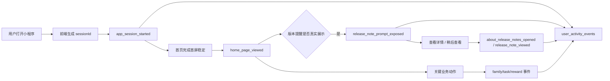

# 里程碑-22R：用户路径与关键行为埋点能力

> **设计状态**：🔴 待审核
> **创建日期**：2026-05-20
> **设计者**：GPT5 Codex
> **审核者**：项目维护者
> **预计工期**：3-4天

---

## 📋 目录

- [需求分析](#需求分析)
- [技术方案](#技术方案)
- [代码结构](#代码结构)
- [实施步骤](#实施步骤)
- [测试方案](#测试方案)
- [风险评估](#风险评估)
- [替代方案](#替代方案)

---

## 需求分析

### 功能描述

`M22Q` 已经建立了 `user_product_state` 与 `user_activity_events` 的基础能力，也能够记录少量关键业务事件，例如首次识别、版本说明查看、帮助入口进入等。但从真实业务使用视角看，这些事件仍不足以稳定回答下面几类问题：

1. 这个用户有没有真正打开小程序？
2. 他有没有真正到达首页？
3. 首页版本提醒有没有曝光给他？
4. 他是从首页提醒进入版本说明，还是从 About / 帮助入口进去的？
5. 一次真实使用过程中，他完成了哪些关键动作，路径顺序是什么？

当前代码更接近“少量关键事件记录”，还不是“可用于业务路径解释的关键路径埋点能力”。`M22R` 的目标不是直接建设完整行为分析平台，而是在现有事件底座上补齐最小可用的会话、页面到达、关键曝光与关键操作事件口径，让业务侧能用大白话解释用户行为路径。

本期能力的正式形态是：

1. 前端程序内埋点
2. 通过受控接口上报到后端
3. 后端做事件白名单校验、补充上下文并落到数据库表
4. 服务端日志仅保留排错用途，不作为正式业务分析源

### 业务价值

- [x] 用户价值：间接提升。通过后续基于路径数据做产品优化，减少用户在首页、提醒、帮助入口上的理解成本。
- [x] 产品价值：可以回答“功能有没有真正被看到”“用户是在哪一步流失的”“哪个入口真正被使用”。
- [x] 技术价值：把现有轻量事件底座演进成可解释的关键路径数据能力，为后续分析后台、漏斗治理和体验评估建立稳定事实基础。

### 功能范围

**包含**：
- ✅ 为前端会话建立正式 `sessionId` 语义
- ✅ 补齐“小程序打开 / 首页到达 / About 到达 / 更新说明页到达”事件
- ✅ 补齐“首页版本提醒曝光 / 查看详情 / 稍后查看”事件
- ✅ 补齐“帮助入口打开 / About 更新入口打开 / 更新说明已查看”链路事件口径
- ✅ 将既有“创建家庭 / 加入家庭 / 创建任务 / 完成任务 / 创建奖励”等关键业务动作纳入同一条会话路径可解释范围
- ✅ 为后端事件接收与存储补充最小字段与去重/白名单策略
- ✅ 支持不停服务下按策略关闭、全量、抽样或定向开启关键路径记录
- ✅ 明确首版能回答什么、不能回答什么

**不包含**：
- ❌ 不做全页面、全点击、全滚动埋点
- ❌ 不做停留时长、热力图、路径 Sankey、可视化报表后台
- ❌ 不做外部 BI、数据仓库、ETL 平台建设
- ❌ 不做实时运营系统或通用审计后台
- ❌ 不在本期追求“完整用户所有行为还原”，只覆盖关键业务路径

### 优先级

- **优先级**：P1
- **理由**：不是核心交易闭环阻塞项，但已经直接影响你对线上用户行为的判断质量；若继续缺失，会让后续很多产品结论停留在猜测层面。

---

## 技术方案

### 方案概述

`M22R` 采用“**复用现有事件表 + 补齐会话与关键路径口径 + 统一前端采集入口**”方案。

核心思路：

1. **不重起一套新分析系统**
   - 继续复用 `user_activity_events`
   - 在现有基础上补齐关键字段和统一事件命名

2. **只覆盖关键路径，不覆盖所有交互**
   - 首版只回答业务最关心的问题
   - 避免一次性把前端所有页面都打上埋点，导致噪音失控

3. **把“用户做了什么”和“用户看到了什么”分开建模**
   - “做了什么”：关键业务动作，如创建家庭、创建任务、完成任务
   - “看到了什么”：关键页面到达、关键提醒曝光、关键入口打开

4. **以会话为主线解释路径**
   - 同一轮打开小程序后的关键事件，统一挂到同一个 `sessionId`
   - 后续分析优先按 `subjectUserId + sessionId + occurredAt` 解释路径
   - 若多个事件 `occurredAt` 相同，则再按 `receivedAt`、`eventId` 升序打破并列

5. **数据库表是正式事实源，日志文件不是**
   - 事件最终必须落到结构化表中
   - 服务端日志只记录上报失败、参数异常等技术问题
   - 任何业务分析、SQL 查询、后台报表都以事件表为准

6. **记录策略必须可动态降级**
   - 不把“所有用户永久全量记录”作为默认前提
   - 通过后端权威策略支持不停服务下关闭、抽样、定向开启
   - 当用户规模、写入压力或排障目标变化时，可快速调整记录范围

### 首版目标问题

`M22R` 首版必须能稳定回答：

1. 用户有没有打开小程序？
2. 用户有没有到达首页？
3. 首页版本提醒有没有真正曝光？
4. 用户是从哪里进入更新说明链路的？
5. 用户在本次会话里做了哪些关键业务动作？

首版明确**不要求**稳定回答：

- 用户停留了多久
- 每个页面每个按钮都点了什么
- 用户完整浏览轨迹百分百还原
- 任意漏斗后台可视化
- 所有用户所有细节事件永久全量保留

### 正式口径定义

#### 1. 小程序打开

事件：`app_session_started`

正式语义：
- 前端创建一条新的业务会话
- 代表用户完成了一次新的可追踪进入
- 不等同于“已经看到首页”
- `sessionId` 定义为**设备前台会话**，不是 `currentUser` 专属会话
- 同一轮前台活跃周期内，允许一个 `sessionId` 下出现多个 `subjectUserId/currentUserId`，以支持家长切换孩子视角
- `subjectUserId` 继续表示该条事件归属的业务主体用户；`sessionId` 只负责把同一次设备使用串起来

#### 2. 到达首页

事件：`home_page_viewed`

正式语义：
- 首页已进入可交互状态
- 应晚于首页关键首屏数据稳定
- 这是“看到首页”的正式判断依据
- 记录规则采用“**每个 sessionId + 每个 subjectUserId + 每个自然日首页首达一次**”
- 同一会话内因为 `onShow`、数据刷新、搜索开关、消息面板收起等重复回到首页，不重复写入

#### 3. 首页版本提醒曝光

事件：`release_note_prompt_exposed`

正式语义：
- 首页轻提醒已经真正展示给用户
- 不等同于“具备展示资格”
- 不等同于“用户点了详情”
- 记录规则采用“**每个 sessionId + 每个 subjectUserId + 每个 version 最多一次真实曝光**”
- 只有组件真正完成展示时才写入；仅具备资格、仅进入 pending、仅被覆盖层阻塞时都不写入

#### 4. 进入更新说明链路

事件：
- `release_note_prompt_detail_clicked`
- `about_release_notes_opened`
- `help_feedback_opened`
- `release_note_viewed`

正式语义：
- 前三个分别表示入口来源
- `release_note_viewed` 表示用户已经进入并看到更新说明详情页
- 首版不再新增 `whats_new_page_viewed` 独立事件，避免与 `release_note_viewed` 形成双口径

#### 5. 关键业务动作

沿用并补齐现有事件：
- `family_created`
- `family_joined`
- `task_created`
- `task_completed`
- `reward_created`

正式语义：
- 这些事件代表用户在会话里真正完成了业务动作
- 应与 `sessionId` 串起来，成为“看到了什么之后做了什么”的解释基础
- 若业务动作在离线状态下先本地完成、后续补云，允许保留原始 `sessionId`，但该事件需额外标记“延迟上报”语义，避免被误判为实时路径

### 技术选型

| 技术点 | 选择方案 | 替代方案 | 选择理由 |
|--------|---------|---------|---------|
| 事件存储 | 复用 `user_activity_events` | 新建独立 analytics 表 | 当前已有事件底座，复用更稳，迁移成本更低 |
| 路径主键 | 新增 `session_id` 显式字段 | 只写进 `payload_json` | 显式字段更利于后续 SQL 查询与后台分析 |
| 前端采集入口 | 新建统一 `user-journey-service` | 各页面直接散写 `recordClientEvent` | 降低埋点口径漂移和重复逻辑 |
| 页面覆盖方式 | 关键页面手工接线 | 全局自动路由埋点 | 微信小程序页面边界复杂，首版手工接线更稳 |
| 事件范围 | 关键路径白名单 | 任意事件开放上报 | 避免噪音、风暴和口径失控 |
| 记录策略 | 后端权威策略动态控制 | 前端写死全量记录 | 支持不停服关闭、抽样、灰度和定向观测 |
| 事实存储位置 | 数据库事件表 | 服务端日志文件 | 结构稳定、可查询、可关联，不与技术日志混用 |

### DDD分层设计

**领域层（models/）**：
- [x] 修改模型：`backend/models/UserActivityEvent.js`
- [ ] 新建模型：无
- 说明：扩展事件白名单、`clientEventId / sessionId / occurredAt / receivedAt` 字段，并统一 `subjectUserId` 业务口径，继续保持“关键事件模型”职责。

**服务层（services/）**：
- [x] 新建服务：`services/user-journey-service.js`（前端）
- [x] 修改服务：`backend/services/userProductStateService.js`
- 说明：前端统一产生会话和路径事件；后端继续复用事件写入能力，但要支持新字段和白名单扩展。

**仓储层（repositories/）**：
- [ ] 新建仓储：无
- [x] 修改仓储：如有必要，扩展后端事件查询辅助模块
- 说明：首版不强制单独引入新仓储抽象，以最小改动落地事件写入和基础查询。

**适配器层（adapters/）**：
- [ ] 新建适配器：无
- [ ] 修改适配器：无
- 说明：继续复用既有 HTTP 和本地存储适配能力。

**表现层（pages/、components/）**：
- [x] 修改页面：`app.js`、`pages/index/`、`packageManage/pages/about/`、`packageManage/pages/whats-new/`
- [ ] 新建页面：无
- [ ] 新建组件：无
- 说明：关键路径事件只在有限页面接线，不追求全页面覆盖。

### 架构图



### 数据模型

#### 1. 事件表扩展

建议在 `user_activity_events` 中新增：

```typescript
interface UserActivityEvent {
  eventId: string;
  clientEventId: string;
  userId: string;
  familyId: string | null;
  sessionId: string | null;
  eventType: string;
  occurredAt: number;
  receivedAt: number;
  appVersion: string | null;
  clientPlatform: string | null;
  clientEnv: string | null;
  sourcePage: string | null;
  subjectUserId: string | null;
  isDelayed: boolean;
  payloadJson: Record<string, unknown> | null;
}
```

字段语义约定：
- `userId`：登录态下的操作者/账号主体，用于回答“是谁在这台设备上发起了本次使用”
- `subjectUserId`：当前业务视角用户，用于回答“本条页面/提醒/动作是面向谁发生的”
- 为兼容 `M22Q` 已有表结构，数据库物理列首版继续复用 `target_user_id`，但在设计、接口、代码变量和 SQL 查询约定中统一称为 `subjectUserId`

新增字段建议：
- `client_event_id VARCHAR(64) NOT NULL` - 客户端单次事件幂等键
- `session_id VARCHAR(64) DEFAULT NULL`
- `occurred_at BIGINT NOT NULL` - 事件真实发生时间，优先用于路径解释
- `received_at BIGINT NOT NULL` - 后端接收时间，用于排查延迟和重试
- `is_delayed TINYINT(1) NOT NULL DEFAULT 0` - 是否离线补发或延迟上报

新增索引建议：
- `uk_user_activity_events_client_event (client_event_id)` - 保证同一事件重试不重复入库
- `idx_user_activity_events_subject_session_time (target_user_id, session_id, occurred_at)`
- `idx_user_activity_events_user_session_time (user_id, session_id, occurred_at)`
- `idx_user_activity_events_received_at (received_at)`

#### 2. 前端会话模型

```typescript
interface JourneySession {
  sessionId: string;
  startedAt: number;
  runtimeVersion: string;
  loginUserId: string;
}
```

规则建议：
- 小程序冷启动创建新 `sessionId`
- 前后台切换超过阈值（如 30 分钟）重新建会话
- 同一次前台活跃周期内复用当前 `sessionId`
- 切换 `currentUser` 不重新创建 `sessionId`；通过每条事件的 `subjectUserId` 区分当前业务视角

#### 3. 客户端事件幂等模型

```typescript
interface JourneyEventEnvelope {
  clientEventId: string;
  sessionId: string | null;
  occurredAt: number;
  receivedAt?: number;
  isDelayed?: boolean;
}
```

规则建议：
- 每次前端准备写入事件时生成新的 `clientEventId`
- 同一事件因网络重试、前端补发、后台重复提交时，必须复用原始 `clientEventId`
- 后端以 `clientEventId` 作为最终幂等键；重复上报返回成功语义，但不重复插入
- `home_page_viewed`、`release_note_prompt_exposed` 的“业务去重”继续由前端服务层控制，`clientEventId` 只解决技术重试带来的重复写库

#### 4. 记录策略模型

```typescript
interface JourneyTrackingPolicy {
  enabled: boolean;
  mode: 'off' | 'core_all' | 'core_sampled' | 'allowlist_only';
  sampleRate?: number;
  allowlistedUserIds?: string[];
  allowlistedFamilyIds?: string[];
  enabledEventTypes?: string[];
}
```

规则建议：
- `off`：关闭前端关键路径事件上报；用于紧急止血或临时降载
- `core_all`：对白名单关键路径事件全量记录；适合用户规模较小或灰度阶段
- `core_sampled`：对白名单关键路径事件做稳定抽样；适合规模增长后的常态运行
- `allowlist_only`：仅对指定用户/家庭开启；适合线上排障和重点跟踪
- 抽样应采用稳定哈希，不可按请求随机，以避免同一用户会话一半被记录、一半丢失
- `enabledEventTypes` 允许进一步只保留首页/版本提醒/关键业务动作中的一部分
- 策略由后端权威下发，前端只执行，不在客户端写死

### 事件清单（首版）

| 事件名 | 含义 | 典型页面 | 备注 |
|--------|------|---------|------|
| `app_session_started` | 新会话开始 | `app` | 代表用户进入可追踪会话 |
| `home_page_viewed` | 首页到达 | `pages/index/` | 代表真正看到首页 |
| `about_page_viewed` | About 到达 | `packageManage/pages/about/` | 代表看到帮助/关于主页面 |
| `release_note_prompt_exposed` | 首页版本提醒曝光 | `pages/index/` | 代表提醒真的显示了 |
| `release_note_prompt_detail_clicked` | 首页提醒点“查看详情” | `pages/index/` | 区分入口来源 |
| `release_note_prompt_later_clicked` | 首页提醒点“稍后查看” | `pages/index/` | 判断被看见但未进入详情 |
| `about_release_notes_opened` | 从 About 入口打开更新说明 | `packageManage/pages/about/` | 已存在，保留 |
| `help_feedback_opened` | 从帮助入口打开 About | `pages/index/` | 已存在，保留 |
| `release_note_viewed` | 更新说明内容被查看 | `packageManage/pages/whats-new/` | 已存在，保留 |
| `family_created` | 创建家庭 | 后端业务动作 | 已存在，补 session 关联 |
| `family_joined` | 加入家庭 | 后端业务动作 | 已存在，补 session 关联 |
| `task_created` | 创建任务 | 后端业务动作 | 已存在，补 session 关联 |
| `task_completed` | 完成任务 | 后端业务动作 | 已存在，补 session 关联 |
| `reward_created` | 创建奖励 | 后端业务动作 | 已存在，补 session 关联 |

### 接口设计

**修改接口**：

| 方法 | 说明 | 关键参数 | 返回值 |
|------|------|---------|--------|
| `POST /api/users/activity-events` | 写入关键路径事件 | `clientEventId, sessionId, occurredAt, subjectUserId, eventType, sourcePage, payload` | `{ success, eventId }` |
| `GET /api/users/activity-policy` | 获取当前记录策略 | `runtimeVersion` | `{ enabled, mode, sampleRate, enabledEventTypes, ... }` |
| `GET /api/users/product-state` | 继续返回版本感知状态 | `targetUserId, runtimeVersion` | `{ canAutoPrompt, ... }` |

**前端新增服务接口**：

| 方法 | 说明 | 参数 | 返回值 |
|------|------|------|--------|
| `startSession(context)` | 创建/复用会话 | `{ loginUser, currentUser, runtimeVersion }` | `{ sessionId }` |
| `getTrackingPolicy(context)` | 获取并缓存记录策略 | `{ loginUser, runtimeVersion }` | `{ enabled, mode, ... }` |
| `trackPageView(pageKey, context, payload)` | 记录页面到达 | `('home_page_viewed', context, payload)` | `{ success }` |
| `trackExposure(eventType, context, payload)` | 记录曝光 | `('release_note_prompt_exposed', ...)` | `{ success }` |
| `trackAction(eventType, context, payload)` | 记录关键动作/点击 | `('about_release_notes_opened', ...)` | `{ success }` |

策略说明：
- `user-journey-service` 在会话启动或鉴权完成后获取一次策略，并做短时本地缓存
- 若策略为 `off`，直接跳过事件上报，不影响主业务
- 若策略为 `core_sampled`，按稳定哈希决定当前 `loginUserId/familyId` 是否进入样本
- 若策略收缩了 `enabledEventTypes`，前端在发送前先过滤；后端仍保留白名单校验做最终兜底

**需要同步补充 `journeyContext` 的既有业务接口**：

| 接口 | 用途 | 本期要求 |
|------|------|---------|
| `POST /api/families` | 创建家庭 | 请求体增加 `journeyContext.{sessionId, occurredAt?, clientEventId?, isDelayed?}` |
| `POST /api/families/join` | 加入家庭 | 请求体增加 `journeyContext.{sessionId, occurredAt?, clientEventId?, isDelayed?}` |
| `POST /api/tasks` | 创建任务 | 请求体增加 `journeyContext.{sessionId, occurredAt?, clientEventId?, isDelayed?}` |
| `PATCH /api/tasks/:taskId/status` | 完成任务 | 请求体增加 `journeyContext.{sessionId, occurredAt?, clientEventId?, isDelayed?}` |
| `POST /api/rewards` | 创建奖励 | 请求体增加 `journeyContext.{sessionId, occurredAt?, clientEventId?, isDelayed?}` |

说明：
- 这些接口已经会在后端写关键业务事件，若不补 `journeyContext`，则无法与前端页面路径稳定串联，也无法保留真实发生时间
- 在线即时动作至少要透传 `sessionId`
- 离线待同步动作必须透传完整 `journeyContext`，以便后端写入正确的 `sessionId / occurredAt / isDelayed / clientEventId`
- 旧请求未携带 `journeyContext` 时允许降级写入 `NULL` 或服务端当前时间，但这类历史或兼容事件不参与严格会话路径解释

---

## 代码结构

### 文件变更清单

**新增文件**：
- `services/user-journey-service.js` - 前端统一会话与关键路径事件服务

**修改文件**：
- `utils/http-client.js` - 扩展事件上报参数
- `backend/models/UserActivityEvent.js` - 扩展白名单、`clientEventId/sessionId/occurredAt/receivedAt` 与 `subjectUserId` 口径
- `backend/services/userProductStateService.js` - 支持会话字段写入
- `backend/services/*tracking-policy*` 或等价策略模块 - 提供记录策略读取与稳定抽样判定
- `backend/controllers/userController.js` - 扩展事件参数校验
- `backend/database/migrations/*.sql` - 为 `user_activity_events` 增加 `client_event_id / session_id / occurred_at / received_at / is_delayed` 并补充索引
- `backend/controllers/familyController.js` - 为创建/加入家庭事件接收 `journeyContext`
- `backend/controllers/taskController.js` - 为创建任务/完成任务事件接收 `journeyContext`
- `backend/controllers/rewardController.js` - 为创建奖励事件接收 `journeyContext`
- 关键动作对应的前端服务/离线同步模块 - 透传并持久化 `journeyContext`
- `app.js` / `utils/app/bootstrap-auth.js` - 会话初始化
- `pages/index/modules/index-release-note.js` - 首页到达与提醒曝光/点击事件
- `packageManage/pages/about/about.js` - About 到达与入口事件
- `packageManage/pages/whats-new/whats-new.js` - 更新说明页到达事件
- 对应前后端测试文件

### 核心代码结构

```javascript
class UserJourneyService {
  startSession(context) {
    // 创建或复用会话
  }

  async trackPageView(eventType, context, payload = {}) {
    // 统一记录页面到达
  }

  async trackExposure(eventType, context, payload = {}) {
    // 统一记录曝光事件
  }

  async trackAction(eventType, context, payload = {}) {
    // 统一记录关键点击/动作
  }
}
```

### 关键函数

**函数1**：`startSession(context)`
- **输入**：当前登录用户、业务视角用户、运行时版本
- **输出**：`{ sessionId }`
- **职责**：为一次前台使用周期建立统一设备会话标识
- **依赖**：`runtimeVersionUtils`、本地轻量状态缓存

**函数2**：`trackPageView(eventType, context, payload)`
- **输入**：事件名、上下文、补充参数
- **输出**：`{ success }`
- **职责**：统一记录首页/About/更新说明页等关键页面到达
- **依赖**：`HttpClient.createUserActivityEvent`

**函数3**：`createActivityEvent(req, res)`
- **输入**：客户端白名单事件
- **输出**：`{ success, eventId }`
- **职责**：校验会话字段、时间字段与事件白名单并写库
- **依赖**：`UserActivityEvent`、`userProductStateService.recordEvent`

---

## 实施步骤

### 第1步：定义事件口径与扩展数据结构（预计0.5天）

- [ ] **任务**：补齐事件清单、`sessionId` 字段、白名单和首版路径口径
- [ ] **验证**：设计评审时能明确回答“能追踪什么、不能追踪什么”
- [ ] **依赖**：无

**实施要点**：
1. 事件名必须稳定，不允许页面自己发明新命名
2. 明确“首页到达”与“首页提醒曝光”不是同一件事
3. 保持新增字段最小化，优先扩展现有表
4. 必须先统一 `sessionId / occurredAt / receivedAt / isDelayed` 口径，再进入接线
5. 必须同时定义记录策略模型，避免实现后默认只能永久全量记录

### 第2步：实现前端统一会话与采集服务（预计1天）

- [ ] **任务**：新增 `user-journey-service`，统一创建会话和发事件
- [ ] **验证**：页面层不直接散写 event payload
- [ ] **依赖**：第1步完成

**实施要点**：
1. 会话逻辑必须集中，不能各页面重复生成
2. 页面层只传“我现在发生了什么”，不处理底层 event 公共字段
3. 对网络失败保持降级，不影响主业务流程
4. 对 `home_page_viewed`、`release_note_prompt_exposed` 做每会话去重
5. 每条事件生成后立即固化 `clientEventId`，重试时不可重新生成
6. 策略判断必须集中，不能由页面自行决定“哪些用户记、哪些用户不记”

### 第3步：接线关键页面与关键业务动作（预计1天）

- [ ] **任务**：在 `app`、首页、About、更新说明页和既有关键业务动作上挂会话/路径事件
- [ ] **验证**：能够拼出“小程序打开 → 首页 → 提醒曝光 → 进入详情 / 执行业务动作”的基础路径
- [ ] **依赖**：第2步完成

**实施要点**：
1. 首页事件触发时机必须在数据稳定后
2. About / 更新说明页只记关键页面到达，不做碎片点击全覆盖
3. 后端业务动作应补上 `journeyContext` 关联，避免前后路径断开
4. 离线补云事件应保留 `occurredAt`，并标记 `isDelayed = true`
5. 本地待同步业务数据若触发关键动作埋点，必须一并保存 `clientEventId` 以支持服务端幂等
6. 即使前端误发了策略关闭范围外的事件，后端也应按当前策略拒绝或丢弃，避免失控

### 第4步：测试与真实库验证（预计0.5-1天）

- [ ] **任务**：补齐前后端单测、页面测试和真实环境日志验证
- [ ] **验证**：事件数量、顺序和字段符合设计口径
- [ ] **依赖**：第3步完成

**实施要点**：
1. 覆盖重复触发与去重场景
2. 覆盖清缓存、切前后台、切换 `currentUser` 场景
3. 用真实库抽查“是否能用 SQL 读懂用户路径”

---

## 测试方案

### 单元测试

| 测试项 | 测试方法 | 预期结果 |
|--------|---------|---------|
| 会话创建 | 测 `startSession()` | 同一活跃周期复用 `sessionId`，超阈值重新创建 |
| 策略关闭 | 测 `getTrackingPolicy()` + 上报入口 | `mode = off` 时不发事件且不影响主流程 |
| 稳定抽样 | 测策略模块 | 同一用户/家庭在同一策略下样本命中结果稳定 |
| 会话切换 | 测 `startSession()` + `currentUser` 切换 | 切换业务视角不重建 `sessionId`，但事件 `subjectUserId` 正确变化 |
| 页面到达事件 | 测 `trackPageView()` | 自动补齐 `sessionId`、版本、用户上下文 |
| 事件白名单 | 测后端 `createActivityEvent` | 非白名单事件拒绝写入 |
| 事件写库 | 测 `recordEvent()` | `clientEventId`、`sessionId`、`occurredAt`、`receivedAt`、`sourcePage`、`payloadJson` 正确落库 |
| 事件幂等 | 测后端 `createActivityEvent` + `recordEvent()` | 同一 `clientEventId` 重复提交不重复落库 |
| 首页曝光 | 测首页模块 | 只有真正展示提醒时才发 `release_note_prompt_exposed` |
| 业务动作路径透传 | 测家庭/任务/奖励控制器 | 关键业务事件能够写入 `journeyContext` 对应字段 |

### 集成测试

- [ ] 首页首屏稳定后，先记录 `home_page_viewed`，后在真实弹出提醒时记录 `release_note_prompt_exposed`
- [ ] About 入口、帮助入口与更新说明页之间的链路事件能用 `sessionId` 串起来
- [ ] 家庭/任务/奖励关键动作与同一会话下的页面事件可按时间顺序解释
- [ ] 离线补云业务动作保留原始 `sessionId + occurredAt`，并通过 `isDelayed` 与实时路径区分
- [ ] 同一事件重复上报时，通过 `clientEventId` 保证最终只落一条正式事实
- [ ] 策略从 `core_all` 切到 `off` 或 `core_sampled` 时，不停服务即可生效

### 手动测试

1. **功能测试**：
   - [ ] 冷启动进入小程序，应生成 `app_session_started`
   - [ ] 首页首屏稳定后，应只记录一次 `home_page_viewed`
   - [ ] 首页提醒真正出现时，应只记录一次 `release_note_prompt_exposed`
   - [ ] 点“查看详情”后，应看到 `release_note_prompt_detail_clicked` 与 `release_note_viewed`
   - [ ] 点“稍后查看”后，应看到 `release_note_prompt_later_clicked`
   - [ ] 从帮助入口、About 入口进入更新说明页，应能区分入口来源
   - [ ] 家长切换孩子视角后，同一 `sessionId` 下能看到不同 `subjectUserId` 的关键路径事件

2. **回归测试**：
   - [ ] 现有版本提醒资格判断不被破坏
   - [ ] 事件上报失败不影响登录、首页渲染、任务/奖励主链路

### 测试覆盖率目标

- 最低要求：85%
- 推荐目标：90%

---

## 风险评估

### 技术风险

| 风险项 | 影响 | 概率 | 应对措施 |
|--------|------|------|---------|
| 埋点过多导致噪音失控 | 高 | 中 | 首版只保留关键路径白名单，不允许自由扩张 |
| 页面 `onShow` / `onLoad` 重复触发导致重复事件 | 高 | 高 | 统一在服务层做轻量去重与时机约束 |
| 会话切分不稳，导致路径断裂 | 中 | 中 | 集中在 `user-journey-service` 管理 `sessionId` |
| 网络失败拖慢主业务 | 高 | 中 | 事件上报必须非阻塞、失败只记录 warn |
| 事件表增长过快 | 中 | 中 | 首版严格控范围，并建立索引与定期评估机制 |
| 用户量增长导致存储/写入压力上升 | 高 | 中 | 通过后端权威策略支持 `off / core_all / core_sampled / allowlist_only` 动态切换 |
| 时间口径不一致导致路径反序 | 高 | 中 | 明确 `occurredAt` 用于解释路径，`receivedAt` 用于排查延迟 |
| 离线补云动作污染实时路径 | 高 | 中 | 增加 `isDelayed` 并在分析时与实时事件区分 |
| 网络重试导致重复事件 | 高 | 中 | 引入 `clientEventId` 幂等键，后端唯一约束兜底 |

### 业务风险

| 风险项 | 影响 | 概率 | 应对措施 |
|--------|------|------|---------|
| 业务误以为已具备“完整行为分析平台” | 高 | 高 | 在设计和交付说明中明确“能回答什么 / 不能回答什么” |
| “看到首页”与“进入小程序”口径混淆 | 高 | 中 | 明确 `app_session_started` 与 `home_page_viewed` 为不同事件 |
| 后续需求持续膨胀 | 中 | 高 | 把首版目标固定为关键路径可还原，不纳入停留时长、热图、BI 报表 |
| “页面到达”和“内容被看到”双口径打架 | 中 | 中 | 首版合并 `whats_new_page_viewed` 到 `release_note_viewed`，避免重复事实 |
| 团队误把该能力当“全量线上监控系统” | 中 | 中 | 明确首版目标是关键路径观测，不是所有用户所有细节的永久审计 |

---

## 替代方案

### 方案A：继续只记录少量业务动作，不做路径埋点

**优点**：
- 改动最小
- 没有新增会话和页面事件复杂度

**缺点**：
- 仍然无法回答“用户是否到达首页、看到了什么”
- 业务判断继续停留在猜测

**结论**：
- 不采用。无法解决当前真实问题。

### 方案B：直接上全量页面与点击埋点平台

**优点**：
- 一次性能力最强
- 理论上可覆盖更多分析问题

**缺点**：
- 范围明显过大
- 埋点口径、噪音治理、性能和数据解释成本都过高
- 与当前项目阶段不匹配

**结论**：
- 不采用。当前阶段收益与成本不成比例。

### 方案C：复用现有事件底座，补齐关键路径会话能力（本方案）

**优点**：
- 与 `M22Q` 现有基础衔接顺滑
- 能以较低成本回答核心业务问题
- 为后续继续扩展保留空间

**缺点**：
- 首版仍不是完整分析平台
- 需要严格治理事件边界，避免后续失控

**结论**：
- 采用。符合当前产品阶段与项目复杂度约束。
