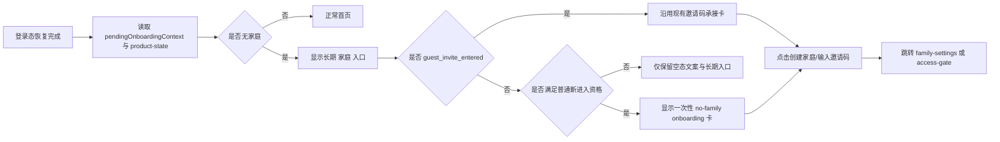

# 里程碑-22S：无家庭入口与新用户家庭引导修复

> **设计状态**：🟢 审核通过
> **创建日期**：2026-05-21
> **设计者**：GPT5 Codex
> **审核者**：项目维护者
> **预计工期**：1-2天

---

## 📋 目录

- [需求分析](#需求分析)
- [现状问题复盘](#现状问题复盘)
- [技术方案](#技术方案)
- [代码结构](#代码结构)
- [实施步骤](#实施步骤)
- [测试方案](#测试方案)
- [风险评估](#风险评估)
- [替代方案](#替代方案)

---

## 需求分析

### 功能描述

线上真实日志与代码排查表明，当前“无家庭家长 / 无家庭孩子 / 新进入但尚未加入家庭的用户”存在主路径断裂问题：

1. `M22E` 之后，首页不再为常规无家庭用户渲染 onboarding 卡，而是要求用户自行进入 `family-settings` 完成“创建家庭 / 输入邀请码加入”。
2. 但当前首页浮动菜单没有 `family-settings` 可见入口，用户切换面板也只保留“帮助与反馈”与条件显示的“添加成员”；对无家庭家长和无家庭孩子而言，这两个地方都无法稳定进入 `family-settings`。
3. `M22N` 又将用户切换底部动作收紧为“仅已入家庭的 manager 且非孩子视角可见”，进一步移除了无家庭家长过去还能误打误撞进入 `family-settings` 的最后一条前台路径。

结果是：用户在首页能看到“请前往家庭设置创建家庭或输入邀请码加入”的文案，但前台没有稳定入口到达该页面。这不是数据问题，而是当前产品主路径真实形成了 dead-end。

与此同时，需要区分两类事实：

1. 当前首页确实通过 `skipNoFamilyStages` 屏蔽了常规 no-family 卡片，因此普通无家庭用户与普通新进入用户不会在首页收到引导卡。
2. 但当前代码仍然保留了 `guest_invite_entered` 场景的一次性承接卡，也就是“通过邀请码落地进入小程序的访客”仍能在首页看到一次性下一步提示。

因此，本期真正的体验缺口不是“首页完全没有任何 onboarding”，而是：

- 普通无家庭用户没有稳定入口
- 非邀请码进入的新进入用户没有首页一次性承接
- 无家庭孩子在一次性承接结束后，缺少长期可达路径

`M22S` 的目标不是重做整套新手体系，而是在保持 `M22L / M22E / M22N / M22Q` 既有边界不被推翻的前提下，补齐一个最小、可持续、可解释的闭环：

1. 无家庭用户在首页必须稳定能到达 `family-settings`
2. 真正“新进入且尚未加入家庭”的用户，首页应收到一次明确但克制的下一步引导
3. `family-settings` 继续作为创建家庭 / 输入邀请码加入的权威承接页，不再把入口职责重新打散到多个页面

### 业务价值

- [x] 用户价值：新用户、无家庭家长与无家庭孩子都不再卡在首页，能明确完成“创建自己的家庭 / 加入已有家庭”的第一步。
- [x] 产品价值：修复当前最核心的新用户主路径缺陷，避免真实用户理解“应该去家庭设置”，但又找不到入口的断裂体验。
- [x] 技术价值：把 `M22Q` 已有的产品状态权威口径复用到首页引导资格判断中，避免再次依赖纯本地缓存推断“是否新用户”。

### 功能范围

**包含**：
- ✅ 为无家庭用户恢复一个稳定可见的 `family-settings` 入口
- ✅ 明确首页无家庭入口的正式承接关系，避免首页文案与可点击路径脱节
- ✅ 为“新进入且尚未加入家庭”的用户恢复一次性首页引导卡
- ✅ 复用 `M22Q` 已有产品状态与事件底座，补齐首页家庭引导资格与已展示状态判断
- ✅ 对无家庭 parent / 无家庭 child / 已入家庭 parent / 已入家庭 child 的首页展示边界重新收口
- ✅ 补齐对应前后端与页面测试，避免后续再次把入口做没

**不包含**：
- ❌ 不重做 `family-settings` 页面视觉或信息架构
- ❌ 不把“创建家庭 / 加入家庭”入口重新塞回用户切换面板
- ❌ 不扩展为完整多页 walkthrough、新手教程或运营漏斗系统
- ❌ 不调整 `M22L` 的邀请码消费链路、`access-gate` 状态机或邀请码中心职责
- ❌ 不在本期建设新的数据库表；只允许复用 `user_product_state / user_activity_events`

### 优先级

- **优先级**：P0
- **理由**：这是当前真实新用户 / 无家庭用户的主路径断裂问题，会直接影响账号第一次进入后的可用性。若不优先修复，后续无论埋点、帮助、版本提醒做得再完整，用户仍会卡在“还没进入家庭”之前。

---

## 现状问题复盘

### 问题1：无家庭首页文案与可达路径已经脱节

当前首页空态文案明确写着：

- “还没有加入家庭，请前往家庭设置创建家庭或输入邀请码加入”

见 [pages/index/index.wxml](/Users/wangdafei/code/study_task_wechat/pages/index/index.wxml) 中无家庭空态分支。

但首页当前实际可见入口只有：

- 顶部头像打开的用户切换面板
- 右下角浮动菜单中的 `分析 / 任务 / 奖励`

其中：

- 浮动菜单没有 `family-settings`
- 用户切换面板也没有“家庭设置”或“创建/加入家庭”入口

因此首页文案和可操作路径已经断开。

### 问题2：`family-settings` 跳转分支仍在，但入口项早已丢失

当前首页点击处理函数里仍保留：

- `item.id === 'family-settings'` 时跳转 `family-settings`

但实际菜单项定义里没有 `family-settings`。这说明：

- 不是页面权限拦截
- 不是路由已删除
- 而是前台“可见入口集合”与“点击处理分支”发生了漂移，形成长期死分支

### 问题3：`M22E` 和 `M22N` 的组合，意外切断了无家庭用户最后一条入口

经过提交链路回溯，真实演变如下：

1. 在更早版本中，用户切换面板底部动作只按 `canManageMembers` 控制，对无家庭家长也会显示底部按钮，因此用户还能通过这条路径跳到 `family-settings`
2. `M22E` 把无家庭承接主入口收口到 `family-settings`，并在测试中显式要求“首页不应为无家庭用户渲染 onboarding 卡，应交给 family-settings 承接”
3. `M22N` 把用户切换底部动作收紧为 `canManageFamilyGovernance === true`，即必须“已加入家庭 + manager + 非孩子视角”才显示

这两次调整各自单看都能自洽，但叠加后导致：

- 无家庭首页没有 onboarding 卡
- 无家庭用户切换面板没有底部动作
- 首页菜单没有 `family-settings`

最终无家庭用户在首页形成 dead-end。

### 问题4：当前“新用户首次进入”的判断仍未被正式用于首页家庭引导

`M22Q` 已经在后端建立了：

- `user_product_state`
- `user_activity_events`
- `/api/users/product-state`

当前该能力已经能返回：

- `firstSeenAt`
- `activatedAt`
- `isCurrentVersionBaseline`
- `isActivatedUser`

但首页家庭引导仍没有消费这组事实口径。结果是：

- 普通新进入用户看不到一次性首页下一步引导
- 当前“首次启动欢迎消息”只依赖本地 `has_welcomed_user`
- 这不足以支撑“是否需要首页新手下一步卡片”的正式判断

同时，当前 `M22Q` 的 `/api/users/product-state` 与前端消费者，本质上仍是围绕“版本提醒资格”命名和组织的。若本期要复用这条链路承接无家庭首页引导，就必须在设计上明确：这是一次**在既有底座上做产品状态语义泛化**，不是零成本顺手复用。

---

## 技术方案

### 方案概述

`M22S` 采用“**首页恢复稳定入口 + 首页补一次性 no-family onboarding + `family-settings` 继续做权威承接页**”方案。

核心思路：

1. **不推翻 `family-settings` 的职责收口**
   - 创建家庭 / 输入邀请码加入的权威页面仍然是 `family-settings`
   - `access-gate` 继续只负责邀请码消费承接

2. **首页必须提供稳定入口**
   - 无家庭用户不能只看到一句文案而没有跳转路径
   - 入口必须是长期可见的，不依赖一次性卡片是否展示过

3. **一次性 onboarding 只服务“真正新进入且尚未加入家庭”的用户**
   - 不是所有无家庭老用户每次回到首页都弹
   - 需要结合 `M22Q` 产品状态与已展示事件判断

4. **不把用户切换面板重新变回家庭治理入口**
   - 用户切换面板维持 `M22N` 的“身份切换优先、治理动作从属”边界
   - 不在本期把“创建家庭 / 加入家庭”重新塞回该面板

### 核心设计决策

#### 决策1：`family-settings` 继续作为无家庭承接页，不改页面职责

本期不重新发明“首页直接创建家庭弹层”或“用户切换页直接输入邀请码”：

- 创建家庭：仍跳转 `family-settings?action=create_family`
- 输入邀请码加入：仍跳转 `family-settings` 或 `access-gate?mode=manual_input`

原因：

- `M22L` 已经把邀请码与家庭承接职责正式收口
- 这次问题是“入口丢了”，不是承接页职责错了
- 若再次把动作分散回首页或用户切换，后续很容易重回多入口分裂

#### 决策2：首页恢复一个稳定可见的“家庭”入口，作为长期 fallback

首页需要恢复一个长期可见的 `family-settings` 入口，建议放在现有浮动菜单中，作为以下两类场景的稳定入口：

- 标签建议：`家庭`
- 跳转目标：`/packageManage/pages/family-settings/family-settings`
- 显示规则：
  - `parent` 自己视角：显示
  - `child` 自己视角且 `familyId == null`：显示
  - 家长切到孩子视角：不显示
  - 已加入家庭的孩子：不显示
  - `systemBlocked`：不显示

原因：

- 这是最直接、最稳定、最不依赖一次性状态的入口
- 能覆盖无家庭家长、无家庭孩子、已入家庭 manager、已入家庭 viewer 四类真实用户
- 能让首页文案“请前往家庭设置”真正有可达路径
- 能避免“无家庭孩子只靠一次性卡片，一旦消费后再次回到首页就无路可走”的断裂

本期不建议把这个长期入口重新放回用户切换面板，避免违背 `M22N` 已定下的“切换页不承载过多治理动作”原则。

补充约束：

- 该入口不是“仅修无家庭问题”的临时按钮，而是正式菜单项
- 因为现有浮动菜单组件只实现了 3 个子项的展开动画，本期必须把 `components/float-menu/` 升级为正式支持第 4 项菜单位移和间距布局，不能依赖“先塞进去再看效果”

#### 决策3：首页为“非邀请码普通进入且无家庭”的用户补一次性 onboarding 卡，并保留现有邀请码承接卡

首页需要恢复一张一次性、轻量、只展示给正确用户的 no-family onboarding 卡。

卡片目标：

- 不是替代长期入口
- 而是给真正新进入且尚未加入家庭的用户一次明确下一步
- 不覆盖当前已存在的 `guest_invite_entered` 承接卡逻辑

文案建议：

- `parent`：
  - 标题：`先创建你的家庭`
  - 描述：`创建后才能添加孩子、安排任务和一起协作。`
  - 主按钮：`创建家庭`
  - 次按钮：`输入邀请码加入`
- `child`：
  - 标题：`输入邀请码加入家庭`
  - 描述：`加入家庭后，你就能查看任务安排和成长进展。`
  - 主按钮：`输入邀请码`

#### 决策4：no-family onboarding 资格复用 `M22Q` 底座，但要显式扩展为更通用的产品状态语义

本期继续复用 `/api/users/product-state` 这条链路，但要在设计上明确它不再只是“版本提醒资格接口”，而是承载多个轻量产品状态切面。对首页 no-family 引导，本期新增一组正式口径：

- `canShowNoFamilyHomeOnboarding`
- `noFamilyOnboardingMode`
- `hasShownNoFamilyHomeOnboardingInCurrentVersion`

建议判断逻辑：

1. **基础条件**
   - 当前业务主体用户 `familyId == null`
   - 当前用户在首页是 parent 自己视角或 child 自己视角
2. **新进入判定**
   - 满足以下之一：
     - 当前存在 `pendingOnboardingContext`，来源为 `guest_invite_entered`
     - 后端产品状态判定该用户仍处于“当前版本基线 + 尚未激活”的新进入阶段
3. **一次性约束**
   - 若当前版本已经记录过 `no_family_home_onboarding_shown`，则不再自动展示

判定优先级：

1. **保留现有邀请码承接优先级**
   - 若 `pendingOnboardingContext.source === 'guest_invite_entered'`，首页继续沿用现有一次性承接卡语义
2. **普通 no-family 新进入补充资格**
   - 仅在没有邀请码承接上下文时，再消费扩展后的 `product-state`
3. **长期入口独立存在**
   - 不论是否命中一次性卡片，只要用户属于“无家庭 parent 自己视角 / 无家庭 child 自己视角”，都仍保留长期 `家庭` 入口

这样做的好处：

- 不再只依赖本地 `has_welcomed_user`
- 清缓存或换设备后，不会把老用户误判成“应该再弹新手家庭引导”
- 与 `M22Q` 已建立的权威状态方向一致

#### 决策5：不新增数据库表，复用 `user_activity_events` 记录引导展示事实

本期不新增新表，仅扩展现有事件类型：

- `no_family_home_onboarding_shown`
- `no_family_home_onboarding_primary_clicked`
- `no_family_home_onboarding_secondary_clicked`

用途：

- 控制一次性展示
- 为后续 `M22R` 埋点能力复用相同事实源
- 避免再次出现“前台以为展示过 / 后台无法解释”的状态漂移

约束与实现口径：

- 前端不直接查询事件明细表
- 后端 `userProductStateService` 在组装 `product-state` 时，通过 `user_id + app_version + event_type = 'no_family_home_onboarding_shown'` 判断“当前版本是否已经展示过”
- `POST /api/users/activity-events` 需要把 no-family onboarding 三个新事件加入客户端白名单
- 若事件上报失败：
  - 不阻断首页渲染
  - 当前会话内可用页面内存态避免连续重复弹
  - 以后端状态作为跨设备、跨清缓存的最终权威口径

#### 决策6：无家庭老用户不强弹，但永远保留长期入口

不是所有无家庭用户都应该持续弹首页卡片。

正式行为建议：

- 新进入且无家庭：显示一次性首页引导卡 + 长期入口
- 非新进入但仍无家庭：不自动弹卡，仅保留长期入口与空态文案

这样既能满足“新用户第一次要有明确引导”，也能避免老用户每次回来都被重复打扰。

### 技术选型

| 技术点 | 选择方案 | 替代方案 | 选择理由 |
|--------|---------|---------|---------|
| 长期入口位置 | 首页浮动菜单新增 `家庭` 项 | 用户切换面板新增入口 / 只保留一次性卡片 | 首页入口更稳定，不破坏 `M22N` 切换页收口，也能覆盖无家庭孩子的一次性卡片消费后路径 |
| 新用户资格判断 | 扩展 `/api/users/product-state` | 纯本地 `has_welcomed_user` | 复用 `M22Q` 权威口径，更稳 |
| 一次性展示记录 | 复用 `user_activity_events`，由后端聚合后再返回 `product-state` | 新增单独 onboarding 状态表 | 当前底座已足够，无需再建新表，同时避免前端直接查事件明细 |
| 承接页 | `family-settings` | 首页本地弹层直接创建/加入 | 保持 `M22L` 既有职责边界 |

### DDD分层设计

**领域层（models/）**：
- [x] 修改模型：`backend/models/UserActivityEvent.js`
- [ ] 新建模型：无
- 说明：补充 no-family onboarding 相关事件类型。

**服务层（services/）**：
- [x] 修改服务：`backend/services/userProductStateService.js`
- [x] 修改服务：`services/user-service.js`
- [ ] 新建服务：可选；若不新增，则由 `user-service` 直接承接产品状态读取
- 说明：后端把 `M22Q` 当前偏 release-note 的产品状态组装逻辑扩展为可承载多个轻量状态切面；前端负责读取首页引导资格，但不直接查询事件明细。

**仓储层（repositories/）**：
- [ ] 新建仓储：无
- [ ] 修改仓储：无
- 说明：首版直接复用现有服务与事件表，不额外拆仓储。

**适配器层（adapters/）**：
- [ ] 新建适配器：无
- [ ] 修改适配器：无
- 说明：继续复用既有 HTTP 客户端和本地状态适配。

**表现层（pages/、components/）**：
- [x] 修改页面：`pages/index/index.js`
- [x] 修改页面：`pages/index/index.wxml`
- [x] 修改模块：`pages/index/modules/index-user-switcher.js`
- [x] 修改组件：`components/float-menu/`
- [ ] 修改页面：`packageManage/pages/family-settings/`（仅在需要补承接态文案时）
- 说明：首页负责稳定入口与一次性卡片；浮动菜单组件需正式支持第四项布局；`family-settings` 继续承接创建/加入动作。

### 架构图



### 数据模型

前端首页引导态：

```typescript
interface HomeNoFamilyOnboardingState {
  canShow: boolean;
  mode: 'parent_create_or_join' | 'child_join_only' | 'none';
  source: 'product_state' | 'pending_context' | 'none';
  shownEventRecorded: boolean;
  hasLongTermEntry: boolean;
}
```

后端产品状态扩展返回：

```typescript
interface UserProductStateResponse {
  userId: string;
  firstSeenAppVersion: string;
  firstSeenAt: number;
  activatedAt: number | null;
  isCurrentVersionBaseline: boolean;
  isActivatedUser: boolean;
  canAutoPrompt: boolean;
  canShowNoFamilyHomeOnboarding: boolean;
  hasShownNoFamilyHomeOnboardingInCurrentVersion: boolean;
  noFamilyOnboardingMode: 'parent_create_or_join' | 'child_join_only' | 'none';
}
```

### 接口设计

**修改现有接口**：

| 方法 | 说明 | 参数 | 返回值 |
|------|------|------|--------|
| `GET /api/users/product-state` | 读取用户产品状态 | `runtimeVersion`, `clientEnv`, `sourcePage`, `targetUserId?` | 现有版本感知字段 + `canShowNoFamilyHomeOnboarding` + `hasShownNoFamilyHomeOnboardingInCurrentVersion` + `noFamilyOnboardingMode` |
| `POST /api/users/activity-events` | 记录 no-family onboarding 展示/点击 | `eventType`, `runtimeVersion`, `sourcePage`, `subjectUserId?`, `payload` | `{ success }` |

---

## 代码结构

### 文件变更清单

**新增文件**：
- 无

**修改文件**：
- `backend/models/UserActivityEvent.js` - 新增 no-family onboarding 相关事件类型
- `backend/services/userProductStateService.js` - 扩展首页家庭引导资格口径
- `backend/controllers/userController.js` - 透传扩展后的产品状态结果
- `services/user-service.js` - 提供前端读取产品状态的方法
- `pages/index/index.js` - 增加首页长期入口与 no-family onboarding 编排
- `pages/index/index.wxml` - 渲染 no-family onboarding 卡与空态配合规则
- `pages/index/modules/index-user-switcher.js` - 将首页菜单生成逻辑纳入 `family-settings` 长期入口
- `components/float-menu/` - 正式支持四项菜单的展开布局、间距与动画
- `test/pages/index.page-shell.behavior.test.js` - 覆盖 no-family 首页入口与 onboarding
- `test/pages/index.modules.test.js` - 覆盖首页菜单第四项与 child/no-family 边界
- `test/services/user-service.test.js` - 覆盖产品状态读取
- `backend/test/unit/userProductStateService.test.js` - 覆盖新资格口径

### 关键函数

**函数1**：`resolveNoFamilyHomeOnboardingState`
- **输入**：`currentUser`, `productState`, `pendingOnboardingContext`
- **输出**：`HomeNoFamilyOnboardingState`
- **职责**：统一判断首页是否应显示一次性无家庭引导卡
- **依赖**：`M22Q` 产品状态、pending onboarding 上下文

**函数2**：`updateMenuItemsWithPermissions`
- **输入**：首页当前视角与权限上下文
- **输出**：更新后的 `menuItems`
- **职责**：在无家庭 parent / 无家庭 child / 已入家庭 parent 合法视角下恢复稳定 `家庭` 入口
- **依赖**：`permission-utils`、当前首页上下文

**函数3**：`getProductState`
- **输入**：`runtimeVersion`, `clientEnv`, `sourcePage`, `targetUserId?`
- **输出**：扩展后的产品状态结果
- **职责**：聚合 release-note awareness 与 no-family onboarding 两类轻量产品状态事实
- **依赖**：`/api/users/product-state`

---

## 实施步骤

### 第1步：扩展产品状态与事件口径（预计0.5天）

- [ ] **任务**：在后端 `userProductStateService` 中增加 no-family 首页引导资格计算、当前版本已展示判定，并补齐 onboarding 展示/点击事件白名单
- [ ] **验证**：后端单元测试覆盖“无家庭新用户 / 无家庭老用户 / 已入家庭用户 / child 无家庭用户”四类状态
- [ ] **依赖**：现有 `M22Q` 表与接口可用

**实施要点**：
1. 不新增数据库表
2. 资格判断必须能解释“为什么这次该弹 / 不该弹”
3. 事件命名与后续 `M22R` 兼容
4. `product-state` 结果中要明确给出“当前版本是否已经展示过”而不是让前端自己查事件表

---

### 第2步：首页恢复长期入口（预计0.5天）

- [ ] **任务**：在首页浮动菜单生成逻辑中补回 `family-settings` 长期入口，并明确无家庭 parent / 无家庭 child / 已入家庭 parent 的显示边界
- [ ] **验证**：无家庭家长、无家庭孩子、已入家庭 manager、viewer、孩子视角的菜单快照与行为测试通过
- [ ] **依赖**：现有首页菜单与权限过滤逻辑

**实施要点**：
1. 不破坏当前 `分析 / 任务 / 奖励` 既有入口
2. `家庭` 入口要与 `M22N` 的身份切换边界兼容
3. 浮动菜单组件必须正式支持第四项，不允许依赖未定义动画位置
4. 已入家庭孩子仍不显示该入口，避免落入 `family-settings` 受限页面后再被动返回

---

### 第3步：首页补一次性 no-family onboarding 卡（预计0.5天）

- [ ] **任务**：首页消费扩展后的产品状态，对真正新进入且无家庭的用户恢复一次性引导卡
- [ ] **验证**：页面行为测试覆盖 parent/child 两类卡片文案、展示时机和点击跳转分支
- [ ] **依赖**：第1步产品状态接口已可用

**实施要点**：
1. 这张卡不替代长期入口
2. 仅在今天视图、无高优先级覆盖层时显示
3. 继续保留现有 `guest_invite_entered` 承接卡优先级，不覆盖邀请码进入主链路
4. 展示后记录事件，避免重复弹出

---

### 第4步：收口空态与回归测试（预计0.5天）

- [ ] **任务**：调整首页空态文案、测试和必要样式，使“长期入口 + 一次性卡片 + family-settings 承接”形成闭环
- [ ] **验证**：页面测试、用户切换测试、后端产品状态测试、定向手工回归通过
- [ ] **依赖**：前3步完成

**实施要点**：
1. 保持 `family-settings` 页面仍是创建/加入家庭唯一权威页
2. 不重新把家庭治理动作塞回用户切换页
3. 真机重点回归“无家庭新用户”与“无家庭老用户”两条路径

---

## 测试方案

### 单元测试

| 测试项 | 测试方法 | 预期结果 |
|--------|---------|---------|
| 无家庭新用户资格判断 | 后端 `userProductStateService` 单测 | 返回 `canShowNoFamilyHomeOnboarding=true` |
| 无家庭老用户资格判断 | 后端单测 | 返回 `canShowNoFamilyHomeOnboarding=false` |
| 已入家庭用户资格判断 | 后端单测 | 不显示 no-family onboarding |
| 当前版本已展示判定 | 后端单测 | `hasShownNoFamilyHomeOnboardingInCurrentVersion` 返回正确 |
| 首页菜单长期入口 | 页面模块测试 | 无家庭 parent / 无家庭 child / 已入家庭 parent 合法视角可见 `家庭` 入口 |
| 四项浮动菜单布局 | 组件/页面测试 | 第四项菜单展开不重叠，点击命中正确 |
| 首页 no-family onboarding 点击分支 | 页面行为测试 | `创建家庭` 跳 `family-settings?action=create_family`；`输入邀请码加入` 跳 `access-gate` |
| 邀请码承接兼容 | onboarding/page 测试 | `guest_invite_entered` 仍沿用既有一次性承接卡 |
| 用户切换页边界 | 组件/页面测试 | 仍不在切换页新增“创建/加入家庭”入口 |

### 集成测试

- [ ] 新用户首次进入首页，无家庭，出现一次性卡片，点击“创建家庭”进入 `family-settings`
- [ ] 无家庭老用户再次进入首页，不再自动弹卡，但仍能通过首页 `家庭` 入口进入承接页
- [ ] 无家庭 child 在首次卡片消费后，再次进入首页仍能通过 `家庭` 入口进入 `family-settings`
- [ ] 已入家庭 manager 仍可通过用户切换页“添加成员”进入 `family-settings`
- [ ] viewer/readonly 家长在已入家庭状态下仍可通过首页 `家庭` 入口查看家庭信息
- [ ] 通过邀请码进入小程序的访客仍展示既有承接卡，不被普通 no-family 卡覆盖

### 手动测试

1. **无家庭新用户 parent**
   - [ ] 首页看到一次性卡片
   - [ ] 首页能找到长期 `家庭` 入口
   - [ ] 创建家庭按钮跳转正确
2. **无家庭老用户 parent**
   - [ ] 不强弹卡
   - [ ] 仍能通过首页 `家庭` 入口进入
3. **无家庭 child**
   - [ ] 首页卡片文案为“输入邀请码加入家庭”
   - [ ] 点击后进入 `access-gate`
   - [ ] 卡片消费后再次进入首页，仍能通过长期 `家庭` 入口进入
4. **已入家庭用户**
   - [ ] 不误出现 no-family 卡
   - [ ] 现有任务、奖励、添加成员路径不回归

---

## 风险评估

| 风险 | 影响 | 概率 | 缓解措施 |
|------|------|------|---------|
| no-family onboarding 资格判断过宽，导致老用户反复弹卡 | 体验打扰 | 中 | 必须结合 `M22Q` 产品状态 + 已展示事件双判断 |
| 无家庭孩子仍缺长期路径，导致一次性卡片消费后再次 dead-end | 主路径未闭环 | 中 | 长期 `家庭` 入口必须覆盖无家庭 child 自己视角 |
| 首页新增第四个浮动菜单项导致布局挤压或重叠 | 视觉回归 | 中 | 将 `float-menu` 第四项支持定义为明确必做项，并补组件/页面测试 |
| 与 `M22N` 用户切换收口边界冲突 | 产品语义回退 | 低 | 不在切换页恢复创建/加入家庭入口，只在首页补长期入口 |
| `product-state` 继续维持 release-note 专属语义，导致接口边界越做越混乱 | 后续维护成本上升 | 中 | 在实现中显式把其收口为“用户轻量产品状态聚合接口”，并补充测试覆盖两个状态切面 |
| 前后端资格口径不一致 | 前台表现漂移 | 中 | 以后端 `product-state` 返回值为准，前端只做渲染与一次性编排 |
| 只修稳定入口、不补新用户一次性卡片，问题理解仍然偏弱 | 新用户仍会困惑 | 高 | 本期将两者作为同一里程碑闭环处理，不拆成两轮 |

---

## 替代方案

### 方案A：只恢复首页长期 `家庭` 入口，不做新用户一次性卡片

优点：
- 改动最小
- 风险最低

缺点：
- 只能解决“找得到入口”，不能解决“新用户第一次该做什么”的理解问题
- 对本次日志里这类用户来说，仍缺少明显下一步引导

**结论**：不建议单独采用。

### 方案B：只恢复首页一次性 onboarding 卡，不恢复长期入口

优点：
- 直接解决新用户第一次进入的理解问题

缺点：
- 一次性卡片消失后，老用户或错过卡片的用户仍找不到 `family-settings`
- 会再次形成“强提示过后没有稳定入口”的问题

**结论**：不建议单独采用。

### 方案C：把“创建家庭 / 加入家庭”重新塞回用户切换面板

优点：
- 用户点头像时可以立即看到动作

缺点：
- 违背 `M22N` 已收口的“身份切换优先”原则
- 会再次把切换页变成家庭治理混合入口

**结论**：不建议采用。

### 推荐方案：首页长期入口 + 首页一次性 no-family onboarding + `family-settings` 权威承接

理由：
- 同时解决“找不到入口”和“第一次不知道做什么”两个真实问题
- 与 `M22L / M22E / M22N / M22Q` 的既有职责边界最兼容
- 能一次性把这条主路径修成闭环，而不是再做局部热补
