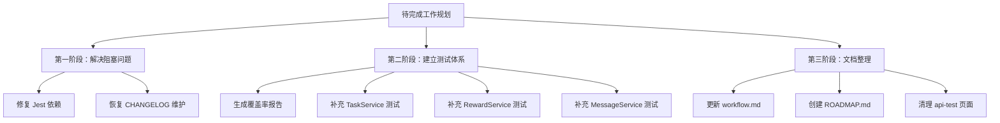

# 项目维护工作详细设计文档

> **设计状态**：🟢 审核通过
> **创建日期**：2026-03-02
> **设计者**：Claude Code
> **审核者**：项目维护者
> **审核日期**：2026-03-02
> **预计工期**：3-4周

---

## 📋 目录

- [需求分析](#需求分析)
- [技术方案](#技术方案)
- [代码结构](#代码结构)
- [实施步骤](#实施步骤)
- [测试方案](#测试方案)
- [风险评估](#风险评估)
- [替代方案](#替代方案)

---

## 需求分析

### 功能描述

本设计文档针对学习任务微信小程序项目的维护工作，解决测试基础设施、文档维护和代码整理等关键问题。工作项按优先级分为 P0（阻塞问题）、P1（高优先级）、P2（中优先级）和 P3（低优先级）四个等级。

核心工作包括：
1. 修复测试依赖管理问题（Jest 未安装）
2. 恢复 CHANGELOG.md 的正常维护流程
3. 建立完整的测试覆盖率报告机制
4. 补充核心服务（TaskService、RewardService、MessageService）的单元测试
5. 完善项目文档（开发流程、路线图）
6. 清理未使用的代码

### 业务价值

- [ ] **用户价值**：提高系统稳定性，减少 bug，提升用户体验
- [ ] **技术价值**：建立测试体系，提高代码质量，降低维护成本
- [ ] **业务价值**：为后续功能开发奠定坚实基础

### 功能范围

**包含**：
- ✅ P0-1 修复 Jest 依赖管理问题
- ✅ P0-2 恢复 CHANGELOG.md 维护
- ✅ P1-3 生成测试覆盖率报告
- ✅ P2-4 补充核心服务单元测试（TaskService、RewardService、MessageService）
- ✅ P3-10 更新开发流程文档
- ✅ P3-11 创建 ROADMAP.md
- ✅ P3-12 清理 api-test 页面

**不包含**（明确的边界）：
- ❌ 惩罚通知功能（留待后续版本）
- ❌ 惩罚金额配置化（留待后续版本）
- ❌ TaskService 重构（留待后续版本）
- ❌ 数据一致性机制（留待后续版本）
- ❌ 性能优化（留待后续版本）

### 优先级

- **优先级**：P0（阻塞问题）
- **理由**：测试依赖缺失完全阻塞测试执行，CHANGELOG 暂停维护无法追踪项目进度

---

## 技术方案

### 方案概述

本方案采用分阶段实施策略，先解决阻塞问题（P0），再建立测试体系（P1-P2），最后完善文档和清理代码（P3）。每个阶段完成后验证无误再进入下一阶段。

### 技术选型

| 技术点 | 选择方案 | 替代方案 | 选择理由 |
|--------|---------|---------|---------|
| 测试框架 | Jest（已配置） | Mocha、Vitest | 项目已配置 Jest，现有测试文件基于 Jest |
| 测试覆盖率 | Jest Coverage Reporter | Istanbul | Jest 内置，配置简单 |
| 测试 Mock | jest.fn()、jest.mock() | Sinon | Jest 原生支持，无需额外依赖 |
| 依赖管理 | npm install | yarn、pnpm | 项目使用 npm，保持一致性 |

### DDD 分层设计

说明涉及的层次：

**领域层（models/）**：
- [ ] 无需修改 - 模型已有部分测试

**服务层（services/）**：
- [ ] 新建测试：`test/services/task-service.test.js`
- [ ] 新建测试：`test/services/reward-service.test.js`
- [ ] 新建测试：`test/services/message-service.test.js`
- 说明：测试核心业务逻辑，验证服务间的协作

**仓储层（repositories/）**：
- [ ] 无需修改 - 通过 Mock 隔离测试

**适配器层（adapters/）**：
- [ ] 无需修改 - 通过 Mock 隔离测试

**表现层（pages/、components/）**：
- [ ] 删除页面：`pages/api-test/`
- 说明：清理未使用的测试页面

### 架构图



### 数据模型

无需新的数据模型，使用现有模型进行测试。

### 接口设计

**测试接口设计**：

| 测试文件 | 测试对象 | 测试覆盖 | 阶段性覆盖率目标 |
|---------|---------|---------|-----------|
| `task-service.test.js` | TaskService | CRUD、状态管理、星星奖励 | 阶段1:70% → 阶段2:80% → 阶段3:85% |
| `reward-service.test.js` | RewardService | 兑换流程、库存管理 | 阶段1:70% → 阶段2:80% → 阶段3:85% |
| `message-service.test.js` | MessageService | 消息创建、已读、过期 | 阶段1:70% → 阶段2:80% → 阶段3:85% |

---

### 测试 Mock 策略

#### 依赖隔离原则

**Repository 层**：
- 使用 `jest.fn()` Mock，返回预定义数据
- 验证调用参数，但不关心实现细节

**EventBus**：
- 使用 `jest.fn()` Mock，验证事件发布
- 确保事件名称和数据正确

**StorageAdapter**：
- 使用现有的 Mock 适配器（`test/__mocks__/wx.js`）
- 避免真实存储操作

**Logger**：
- 使用全局 Mock（已在 jest-setup.js 中配置）
- 避免测试日志污染输出

#### Mock 示例

```javascript
// Mock Repository
const taskRepository = {
  create: jest.fn().mockResolvedValue({ id: '1', title: 'test' }),
  update: jest.fn().mockResolvedValue(true),
  delete: jest.fn().mockResolvedValue(true),
  findById: jest.fn().mockResolvedValue({ id: '1', title: 'test' }),
  findAll: jest.fn().mockResolvedValue([])
};

// Mock EventBus
const eventBus = {
  publish: jest.fn()
};

// Mock Logger
jest.mock('../../utils/logger', () => ({
  info: jest.fn(),
  warn: jest.fn(),
  error: jest.fn(),
  debug: jest.fn()
}));
```

#### 可测试性检查清单

在编写测试前，确保：
- [ ] 服务方法为 async，便于测试
- [ ] 依赖可以通过构造函数或参数传递
- [ ] 避免在方法内部直接实例化依赖
- [ ] 复杂逻辑可拆分为小方法测试

---

## 代码结构

### 文件变更清单

**新增文件**：
- `test/services/task-service.test.js` - TaskService 单元测试
- `test/services/reward-service.test.js` - RewardService 单元测试
- `test/services/message-service.test.js` - MessageService 单元测试
- `docs/ROADMAP.md` - 项目路线图
- `coverage/` - 测试覆盖率报告目录（自动生成）

**修改文件**：
- `package.json` - 无需修改（仅运行 npm install）
- `docs/development/CHANGELOG.md` - 移除"暂停维护"说明
- `jest.config.js` - 调整覆盖率阈值为 85%
- `docs/development/workflow.md` - 根据实际情况更新

**删除文件**：
- `pages/api-test/` - 整个目录

### 核心代码结构

**测试文件结构示例**：

```javascript
// test/services/task-service.test.js

const TaskService = require('../../services/task-service');
const Task = require('../../models/task');
const logger = require('../../utils/logger');

// Mock dependencies
jest.mock('../../repositories/task-repository');
jest.mock('../../models/task');
jest.mock('../../utils/logger');
jest.mock('../../services/star-service');

const TaskRepository = require('../../repositories/task-repository');
const StarService = require('../../services/star-service');

describe('TaskService', () => {
  let taskService;
  let mockTaskRepository;
  let mockStarService;
  let mockEventBus;

  beforeEach(() => {
    // Clear all mocks before each test
    jest.clearAllMocks();

    // Create mock instances
    mockTaskRepository = {
      create: jest.fn(),
      update: jest.fn(),
      delete: jest.fn(),
      findById: jest.fn(),
      findAll: jest.fn(),
      findTodayTasks: jest.fn()
    };

    mockStarService = {
      awardStars: jest.fn()
    };

    mockEventBus = {
      publish: jest.fn()
    };

    // Initialize service with mock dependencies
    taskService = new TaskService({
      taskRepository: mockTaskRepository,
      starService: mockStarService,
      eventBus: mockEventBus
    });
  });

  describe('createTask', () => {
    it('should create a valid task successfully', async () => {
      const taskData = {
        title: '完成数学作业',
        type: 'study',
        priority: 'medium'
      };

      const mockCreatedTask = {
        id: '1',
        ...taskData,
        status: 'pending',
        createdAt: new Date()
      };

      TaskRepository.create.mockResolvedValue(mockCreatedTask);

      const result = await taskService.createTask(taskData);

      expect(result.success).toBe(true);
      expect(result.data).toEqual(mockCreatedTask);
      expect(mockTaskRepository.create).toHaveBeenCalledWith(
        expect.objectContaining(taskData)
      );
      expect(mockEventBus.publish).toHaveBeenCalledWith(
        'task:created',
        expect.objectContaining({ taskId: '1' })
      );
    });

    it('should validate task data and return error for invalid input', async () => {
      const invalidTaskData = {
        title: '', // 无效：标题为空
        type: 'invalid_type' // 无效：类型不存在
      };

      const result = await taskService.createTask(invalidTaskData);

      expect(result.success).toBe(false);
      expect(result.message).toContain('验证失败');
      expect(mockTaskRepository.create).not.toHaveBeenCalled();
      expect(logger.error).toHaveBeenCalled();
    });
  });

  describe('completeTask', () => {
    it('should award stars when task is completed', async () => {
      const taskId = '1';
      const mockTask = {
        id: taskId,
        title: '测试任务',
        type: 'study',
        priority: 'medium',
        status: 'pending'
      };

      mockTaskRepository.findById.mockResolvedValue(mockTask);
      mockTaskRepository.update.mockResolvedValue(true);
      mockStarService.awardStars.mockResolvedValue({
        success: true,
        stars: 3
      });

      const result = await taskService.completeTask(taskId);

      expect(result.success).toBe(true);
      expect(mockStarService.awardStars).toHaveBeenCalledWith(
        taskId,
        mockTask.type,
        mockTask.priority
      );
      expect(mockEventBus.publish).toHaveBeenCalledWith(
        'task:completed',
        expect.objectContaining({ taskId })
      );
    });

    it('should handle task not found error', async () => {
      const taskId = 'nonexistent';
      mockTaskRepository.findById.mockResolvedValue(null);

      const result = await taskService.completeTask(taskId);

      expect(result.success).toBe(false);
      expect(result.message).toContain('任务不存在');
      expect(mockStarService.awardStars).not.toHaveBeenCalled();
    });
  });
});
```

### 关键函数

**函数1**：`npm install`
- **输入**：无
- **输出**：安装 Jest 依赖
- **职责**：解决测试依赖缺失问题
- **依赖**：npm 包管理器

**函数2**：`npm run test:coverage`
- **输入**：无
- **输出**：生成覆盖率报告
- **职责**：生成测试覆盖率报告
- **依赖**：Jest、测试文件

---

## 实施步骤

### 第0步：可行性验证（预计1-2小时）

- [ ] **任务**：检查现有测试是否可运行，验证代码可测试性
- [ ] **验证**：现有测试文件可以运行，可测试性检查通过
- [ ] **依赖**：无

**实施要点**：
1. 运行 `npm install` 安装 Jest 依赖
2. 验证 `test/models/task.test.js` 是否有依赖问题
3. 验证 `test/services/star-service.test.js` 是否需要更新 Mock
4. 检查现有服务的可测试性：
   - [ ] TaskService 是否支持依赖注入
   - [ ] RewardService 是否支持 Mock StarService
   - [ ] MessageService 是否支持 Mock MessageRepository
   - [ ] 服务方法是否为 async，便于测试
5. 运行现有测试，记录失败原因

**可测试性检查清单**：
- [ ] 服务方法为 async，便于测试
- [ ] 依赖可以通过构造函数或参数传递
- [ ] 避免在方法内部直接实例化依赖
- [ ] 复杂逻辑可拆分为小方法测试

**预期结果**：
- Jest 依赖成功安装
- 现有测试可以运行（可能有失败，但框架正常）
- 明确各服务的可测试性现状
- 识别需要重构的代码（如有）

---

### 第1步：修复 Jest 依赖（预计30分钟）

- [ ] **任务**：确保 Jest 依赖完整安装
- [ ] **验证**：运行 `npm test` 确保测试框架正常
- [ ] **依赖**：第0步完成

- [ ] **任务**：运行 `npm install` 安装 Jest 依赖
- [ ] **验证**：运行 `npm test` 确保测试可执行
- [ ] **依赖**：无

**实施要点**：
1. 运行 `npm install` 安装 package.json 中的 devDependencies
2. 验证 Jest 是否成功安装：`npm list jest`
3. 运行现有测试：`npm test`
4. 确保所有现有测试通过

---

### 第2步：恢复 CHANGELOG.md 维护（预计20分钟）

- [ ] **任务**：移除"暂停维护"说明，恢复为正常更新日志
- [ ] **验证**：文档结构正常，可以继续更新
- [ ] **依赖**：第1步完成

**实施要点**：
1. 移除第3-6行的"暂停维护"说明
2. 保留 v3.1.1 的记录作为最近版本
3. 更新"维护说明"部分
4. 建立新代码提交时同步更新 CHANGELOG 的流程

---

### 第3步：生成测试覆盖率报告（预计30分钟）

- [ ] **任务**：运行 `npm run test:coverage` 生成覆盖率报告
- [ ] **验证**：coverage/ 目录生成，覆盖率数据正确
- [ ] **依赖**：第1步完成

**实施要点**：
1. 运行 `npm run test:coverage` 生成覆盖率报告
2. 检查 coverage/index.html 查看详细覆盖情况
3. 调整 jest.config.js 中的覆盖率阈值为 70%（阶段1目标）

**渐进式覆盖率目标调整**：

```javascript
// 阶段1：实施初期（当前调整）
coverageThreshold: {
  global: {
    branches: 70,
    functions: 70,
    lines: 70,
    statements: 70
  }
}

// 阶段2：核心服务测试完成后
coverageThreshold: {
  global: {
    branches: 80,
    functions: 80,
    lines: 80,
    statements: 80
  }
}

// 阶段3：长期目标
coverageThreshold: {
  global: {
    branches: 85,
    functions: 85,
    lines: 85,
    statements: 85
  }
}
```

---

### 第4步：补充 TaskService 单元测试（预计3-5天）

- [ ] **任务**：创建 TaskService 完整的单元测试
- [ ] **验证**：测试覆盖率 ≥70%，所有测试通过
- [ ] **依赖**：第0、1步完成

**测试覆盖范围**：
1. **CRUD 操作**：
   - `createTask` - 创建任务
   - `updateTask` - 更新任务
   - `deleteTask` - 删除任务
   - `getTask` - 获取单个任务
   - `getAllTasks` - 获取所有任务
   - `getTodayTasks` - 获取今日任务

2. **状态管理**：
   - `completeTask` - 完成任务
   - `undoCompletion` - 撤销完成
   - `getTaskStats` - 任务统计

3. **边界条件**：
   - 无效输入验证
   - 任务不存在情况
   - 权限检查

4. **错误处理**：
   - 存储失败
   - 数据验证失败

5. **事件发布**：
   - 任务创建事件
   - 任务完成事件
   - 任务删除事件

---

### 第5步：补充 RewardService 单元测试（预计2-4天）

- [ ] **任务**：创建 RewardService 完整的单元测试
- [ ] **验证**：测试覆盖率 ≥70%，所有测试通过
- [ ] **依赖**：第0、1步完成

**测试覆盖范围**：
1. **奖励管理**：
   - `createReward` - 创建奖励
   - `updateReward` - 更新奖励
   - `deleteReward` - 删除奖励
   - `getReward` - 获取单个奖励
   - `getAllRewards` - 获取所有奖励

2. **兑换流程**：
   - `claimReward` - 兑换奖励
   - `confirmClaim` - 确认领取
   - `cancelClaim` - 取消兑换

3. **库存管理**：
   - `updateStock` - 更新库存
   - `checkAvailability` - 检查可用性

4. **边界条件**：
   - 库存不足
   - 星星不足
   - 奖励已禁用

5. **错误处理**：
   - 数据验证失败
   - 存储操作失败

---

### 第6步：补充 MessageService 单元测试（预计2-3天）

- [ ] **任务**：创建 MessageService 完整的单元测试
- [ ] **验证**：测试覆盖率 ≥70%，所有测试通过
- [ ] **依赖**：第0、1步完成

**测试覆盖范围**：
1. **消息管理**：
   - `createMessage` - 创建消息
   - `getMessage` - 获取消息
   - `getAllMessages` - 获取所有消息
   - `getMessagesByType` - 按类型获取消息

2. **状态管理**：
   - `markAsRead` - 标记已读
   - `markAllAsRead` - 全部标记已读
   - `deleteMessage` - 删除消息

3. **批量操作**：
   - `batchCreateMessages` - 批量创建消息
   - `batchMarkAsRead` - 批量标记已读

4. **边界条件**：
   - 消息过期
   - 消息不存在
   - 无效输入

5. **错误处理**：
   - 数据验证失败
   - 存储操作失败

---

### 第7步：更新开发流程文档（预计2小时）

- [ ] **任务**：根据最近的开发调整更新 workflow.md
- [ ] **验证**：文档与实际开发流程一致
- [ ] **依赖**：第2步完成

**更新内容**：
- 确认文档与实际开发流程一致
- 补充最新的最佳实践
- 更新示例代码
- 检查文档重复问题

---

### 第8步：创建 ROADMAP.md（预计1天）

- [ ] **任务**：创建项目路线图文档
- [ ] **验证**：路线图清晰、可执行
- [ ] **依赖**：无

**内容建议**：
- **短期目标**（1-3个月）：
  - 完成核心服务测试覆盖
  - 修复现有 bug
  - 小功能优化

- **中期目标**（3-6个月）：
  - 新增用户体验优化功能
  - 完善数据分析功能
  - 性能优化

- **长期愿景**（6-12个月）：
  - 功能扩展
  - 技术升级
  - 生态建设

- **技术演进路线**：
  - 测试体系完善
  - 代码质量提升
  - 架构优化

---

### 第9步：清理 api-test 页面（预计15分钟）

- [ ] **任务**：删除 api-test 测试页面
- [ ] **验证**：页面已清理，app.json 配置已更新
- [ ] **依赖**：无

**处理方案**：
1. 删除 `pages/api-test/` 整个目录
2. 从 `app.json` 中移除该页面的路由配置
3. 确认无其他地方引用该页面
4. 提交 Git，保留历史记录以便回滚

---

## 测试方案

### 单元测试

每个服务的测试将覆盖：

| 测试项 | 测试方法 | 预期结果 |
|--------|---------|---------|
| 正常业务流程 | 调用方法，验证返回值 | 返回正确结果 |
| 边界条件 | 测试极端值和边界情况 | 正确处理边界 |
| 错误处理 | 模拟错误，验证处理逻辑 | 正确捕获和处理错误 |
| 事件发布 | 验证事件是否正确发布 | 事件按预期发布 |

### 集成测试

- [ ] 场景1：任务完成触发星星奖励
- [ ] 场景2：星星消费兑换奖励
- [ ] 场景3：奖励兑换触发消息通知

### 测试兼容性保证

**执行顺序**：
1. 先运行现有测试，确保无回归
2. 新增测试文件
3. 运行所有测试（npm test）
4. 生成覆盖率报告（npm run test:coverage）

**兼容性检查**：
- [ ] 新增测试不影响现有测试
- [ ] 测试 Mock 不冲突
- [ ] 全局 setup 文件正常工作

### 手动测试

参考 `docs/development/coding_standards.md` 中的测试流程：

1. **功能测试**：
   - [ ] 测试项1：任务管理功能正常
   - [ ] 测试项2：奖励兑换功能正常
   - [ ] 测试项3：消息通知功能正常

2. **回归测试**：
   - [ ] 确保现有功能未破坏

### 验收标准

**代码质量**：
- [ ] 所有测试通过（无失败、无跳过）
- [ ] 测试覆盖率 ≥ 70%（阶段1目标）
- [ ] 无 eslint 错误
- [ ] 测试代码符合项目编码规范

**文档质量**：
- [ ] CHANGELOG.md 同步更新
- [ ] 每个测试文件有清晰的注释
- [ ] 复杂测试场景有说明

**测试质量**：
- [ ] 测试用例覆盖正常流程
- [ ] 测试用例覆盖边界条件
- [ ] 测试用例覆盖错误处理
- [ ] 无不必要的测试（不测试实现细节）

### 渐进式覆盖率目标

**阶段1：实施初期（第0-6步完成后）**
- 最低要求：70%
- 重点覆盖核心业务逻辑
- 覆盖率阈值配置：branches/70, functions/70, lines/70, statements/70

**阶段2：核心服务测试完成后（稳定运行1-2周）**
- 目标：80%
- 覆盖边界条件和错误处理
- 覆盖率阈值配置：branches/80, functions/80, lines/80, statements/80

**阶段3：长期目标（持续改进）**
- 最终目标：85%
- 持续改进和维护
- 覆盖率阈值配置：branches/85, functions/85, lines/85, statements/85

---

## 风险评估

### 技术风险

| 风险项 | 影响 | 概率 | 应对措施 |
|--------|------|------|---------|
| Jest 安装失败 | 高 | 低 | 检查网络连接，使用淘宝镜像或离线安装 |
| Mock 配置复杂 | 中 | 中 | 参考现有测试文件的 Mock 方式，制定 Mock 策略 |
| 测试覆盖率不达标 | 高 | 中 | 采用渐进式目标，分阶段提升 |
| 现有代码缺少依赖注入 | 高 | 高 | 使用 Jest Mock 功能隔离依赖，必要时重构代码 |
| 测试执行时间过长 | 中 | 中 | 使用测试分组，隔离慢速测试 |

### 业务风险

| 风险项 | 影响 | 概率 | 应对措施 |
|--------|------|------|---------|
| 测试编写耗时过长 | 中 | 中 | 分批实施，优先核心服务，必要时调整计划 |
| 文档更新滞后 | 低 | 低 | 建立文档同步更新流程 |

### 回滚计划

| 阶段 | 风险场景 | 回滚策略 |
|------|---------|---------|
| 第0-1步 | npm install 失败 | 检查网络，使用淘宝镜像或离线安装；删除 node_modules 重新安装 |
| 第0步 | 代码可测试性差 | 记录需要重构的代码，优先测试可测试部分，复杂方法暂缓 |
| 第2步 | CHANGELOG 更新引起误解 | 在 Git 历史中保留旧版本，可随时回滚 |
| 第4-6步 | 测试编写困难 | 先测试核心方法，复杂方法可暂缓；采用测试驱动重构 |
| 第9步 | 删除 api-test 页面后发现需要 | 从 Git 历史恢复 |

### 应急预案

**如果测试覆盖率无法达到目标**：
1. 分析覆盖率报告，识别未覆盖的核心逻辑
2. 优先覆盖高价值代码路径（核心业务逻辑）
3. 降低覆盖率目标（如从 70% 降至 60%），记录原因
4. 制定后续提升计划

**如果测试编写严重超时**：
1. 评估剩余测试的价值
2. 调整计划，优先完成最高价值测试
3. 延后部分测试到后续迭代
4. 在 CHANGELOG 中记录未完成的测试

---

## 替代方案

### 方案A：当前方案（分阶段实施）

**优势**：
- ✅ 风险可控，每阶段验证
- ✅ 优先解决阻塞问题
- ✅ 渐进式改进

**劣势**：
- ❌ 总体工期较长

---

### 方案B：一次性实施所有工作

**描述**：同时进行所有工作项的实施

**优势**：
- ✅ 短期内完成所有工作

**劣势**：
- ❌ 风险高，难以定位问题
- ❌ 可能阻塞开发进度
- ❌ 回滚困难

**未选择原因**：风险过高，不符合渐进式改进原则

---

### 方案C：跳过测试补充，直接开发新功能

**描述**：不补充测试，直接进入新功能开发

**优势**：
- ✅ 快速推进新功能

**劣势**：
- ❌ 代码质量无法保证
- ❌ 后期维护成本高
- ❌ 可能引入 bug

**未选择原因**：测试覆盖率是项目健康的重要指标，必须优先建立

---

## 审核记录

### 审核要点

- [x] **符合DDD架构**：✅ 微信小程序原生、本地存储
- [x] **技术方案合理**：✅ 分阶段实施，渐进式改进
- [x] **实施步骤清晰**：✅ 每步有明确任务和验证标准
- [x] **风险评估充分**：✅ 识别技术风险和业务风险，提供回滚计划
- [x] **测试方案完整**：✅ 覆盖正常流程、边界条件、错误处理

### 审核意见

**审核者**：项目维护者
**审核日期**：2026-03-02
**审核结果**：✅ 通过

**意见**：
设计文档结构完整，技术方案合理。经过专业评审后进行以下改进：
- 增加"第0步：可行性验证"，确保现有测试可运行
- 补充"测试 Mock 策略"，明确依赖隔离原则
- 调整时间估算，采用更现实的工期
- 采用渐进式覆盖率目标，分阶段提升质量
- 增加回滚计划和应急预案，降低风险
- 补充详细验收标准，确保交付质量
- 简化 api-test 页面清理流程，直接删除测试页面

**修改记录**：
- [x] 修改项1：增加第0步可行性验证（已完成）
- [x] 修改项2：补充测试 Mock 策略（已完成）
- [x] 修改项3：调整时间估算（已完成）
- [x] 修改项4：采用渐进式覆盖率目标（已完成）
- [x] 修改项5：增加回滚计划（已完成）
- [x] 修改项6：补充详细验收标准（已完成）
- [x] 修改项7：更新测试文件示例（已完成）
- [x] 修改项8：简化 api-test 页面清理（已完成）

---

## 附录

### 参考资料

- [Jest 官方文档](https://jestjs.io/docs/getting-started)
- [项目架构文档](../architecture/architecture.md)
- [编码规范](../development/coding_standards.md)

### 相关 Issue/PR

- 无

---

**最后更新**：2026-03-02（版本 v1.1 - 根据专业评审意见修改）
