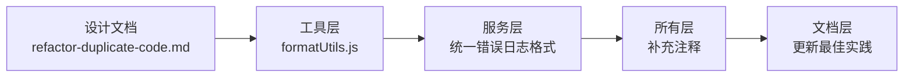

# 代码质量提升和清理 详细设计文档

> **设计状态**：✅ 已完成
> **创建日期**：2026-03-03
> **修订日期**：2026-03-03
> **完成日期**：2026-03-03
> **设计者**：Claude Code 团队
> **审核者**：项目维护团队
> **实际工期**：1天

---

## 📋 目录

- [需求分析](#需求分析)
- [技术方案](#技术方案)
- [代码结构](#代码结构)
- [实施步骤](#实施步骤)
- [测试方案](#测试方案)
- [风险评估](#风险评估)

---

## 需求分析

### 功能描述

通过清理真正的重复代码、统一代码风格、补充代码注释，提升代码质量和可维护性。重点聚焦于实际的代码质量问题，避免过度设计。

### 业务价值

- [ ] **用户价值**：无明显直接影响，间接提升系统稳定性
- [ ] **技术价值**：提升代码一致性，降低长期维护成本
- [ ] **业务价值**：为未来功能扩展奠定良好基础

### 功能范围

**包含**：
- ✅ 删除 `formatUtils.formatDateTime`（已由 `dateUtils` 提供）
- ✅ 统一错误处理日志格式（提供模板，非装饰器）
- ✅ 补充关键代码的中文注释
- ✅ 清理未使用的导入和变量
- ✅ 更新相关文档

**不包含**（明确的边界）：
- ❌ 不引入新的抽象层（装饰器、Mixin 等）
- ❌ 不改变现有架构（保持 DDD 分层）
- ❌ 不破坏模型封装性（保持模型状态常量在模型内）
- ❌ 不追求代码量减少（聚焦质量提升）

### 优先级

- **优先级**：P1
- **理由**：代码质量问题影响长期可维护性，但非紧急

---

## 技术方案

### 方案概述

采用渐进式、低风险的方式提升代码质量。每次改进确保：
1. 保持现有 API 不变
2. 所有测试通过
3. 代码覆盖不降低
4. 不引入新的技术复杂性

### 技术选型

| 技术点 | 选择方案 | 未选择方案 | 理由 |
|--------|---------|-----------|------|
| 日期格式化 | 删除 `formatUtils.formatDateTime`，统一使用 `dateUtils` | 合并到 dateUtils | 保持职责分离，dateUtils 负责日期处理，formatUtils 只负责显示格式化 |
| 错误处理 | 提供统一模板和工具函数 | 装饰器模式 | 装饰器不适合微信小程序环境，模板更简单直接 |
| 用户过滤 | 保持现有代码 | BaseRepository 过滤器 | 只4-5处重复，价值不明显，过度抽象 |
| 常量定义 | 保持模型自包含 | 统一到 constants.js | 符合 DDD 封装原则，破坏模型自包含 |

### DDD分层设计

**领域层（models/）**：
- [ ] 保持不变：模型状态常量保留在模型内
- 说明：符合 DDD 领域模型自包含原则

**服务层（services/）**：
- [ ] 修改服务：统一错误处理日志格式，补充注释
- 说明：提升可读性和调试体验

**仓储层（repositories/）**：
- [ ] 保持不变：用户过滤逻辑保持现有实现
- 说明：避免过度抽象

**工具层（utils/）**：
- [ ] 修改工具：删除 `formatUtils.formatDateTime`，保留其他格式化方法
- 说明：移除重复功能

**文档层（docs/）**：
- [ ] 更新文档：补充错误处理最佳实践说明
- 说明：指导后续开发

### 代码改动范围



### 数据模型

无新增或修改数据模型。

### 接口设计

**无新增接口** - 保持所有现有 API 不变

**工具函数优化**：

| 当前状态 | 优化后 | 说明 |
|---------|--------|------|
| `formatUtils.formatDateTime()` | 删除 | 功能由 `dateUtils.formatDate` + `dateUtils.formatTime` 替代 |
| `formatUtils.formatPoints()` | 保持 | 保留，功能独特 |
| 服务错误处理日志格式 | 统一模板 | 提升可读性 |

---

## 代码结构

### 文件变更清单

**修改文件**：
- `utils/formatUtils.js` - 删除 `formatDateTime` 方法
- `services/task-service.js` - 统一错误日志格式，补充注释
- `services/star-service.js` - 统一错误日志格式，补充注释
- `services/reward-service.js` - 统一错误日志格式，补充注释
- `services/message-service.js` - 统一错误日志格式，补充注释
- `services/user-service.js` - 统一错误日志格式，补充注释
- `pages/index/index.js` - 替换 `formatUtils.formatDateTime` 为 `dateUtils` 方法
- `docs/development/coding_standards.md` - 补充错误处理最佳实践

**预期清理量**：
- 删除重复代码：约 50-100 行
- 补充中文注释：约 30-50 行
- 修改导入语句：约 10-15 处

### 核心代码结构

```javascript
// utils/formatUtils.js - 删除 formatDateTime

/**
 * formatUtils.js - 格式化工具函数
 *
 * 提供数据格式化函数，用于UI显示等
 */

const logger = require('./logger');

/**
 * 格式化星星数量
 * @param {Number} points 要格式化的星星数量
 * @param {Boolean} useThousandSeparator 是否使用千位分隔符
 * @returns {String} 格式化后的星星数量字符串
 */
function formatPoints(points, useThousandSeparator = false) {
  const numPoints = parseInt(points, 10) || 0;
  logger.info('formatUtils', `格式化星星数量: ${points}, 使用千位分隔符: ${useThousandSeparator}`);

  if (useThousandSeparator) {
    return numPoints.toString().replace(/\B(?=(\d{3})+(?!\d))/g, ',');
  }

  return numPoints.toString();
}

module.exports = {
  formatPoints
  // formatDateTime 已删除，使用 dateUtils 替代
};
```

```javascript
// services/xxx-service.js - 统一错误处理日志格式

// ❌ 优化前（示例1）
} catch (error) {
  logger.error('StarService', `添加星星失败: ${error.message}`, error);
  return {
    success: false,
    message: '添加星星失败',
    error: error.message
  };
}

// ❌ 优化前（示例2）
} catch (error) {
  logger.error('StarService', '星星添加过程中发生错误', error);
  return {
    success: false,
    message: '星星添加失败'
  };
}

// ✅ 优化后（统一模板）
/**
 * 添加星星
 * @param {String} userId 用户ID
 * @param {Number} amount 星星数量
 * @param {String} source 来源
 * @returns {Promise<Object>} 结果对象
 */
async addStars(userId, amount, source) {
  try {
    // ... 业务逻辑 ...

    logger.info('StarService', `星星添加成功, 用户=${userId}, 数量=${amount}, 来源=${source}`);
    return {
      success: true,
      stars: amount
    };
  } catch (error) {
    // 统一的错误处理格式
    logger.error('StarService', `添加星星失败, 用户=${userId}, 数量=${amount}, 错误=${error.message}`, error);
    return {
      success: false,
      message: '添加星星失败',
      error: error.message
    };
  }
}
```

```javascript
// docs/development/coding_standards.md - 补充错误处理最佳实践

## 错误处理最佳实践

### 统一错误日志格式

所有服务层的错误处理应遵循以下模板：

```javascript
try {
  // ... 业务逻辑 ...

  logger.info('ServiceName', `操作成功, 参数信息`);
  return {
    success: true,
    data: result
  };
} catch (error) {
  // 统一的错误处理格式
  logger.error('ServiceName', `操作失败, 参数信息, 错误=${error.message}`, error);
  return {
    success: false,
    message: '操作失败',
    error: error.message
  };
}
```

### 日志内容要求

**成功日志**：
- 记录操作类型
- 记录关键参数（如用户ID、数量等）
- 格式：`操作成功, 参数信息`

**错误日志**：
- 记录操作类型
- 记录关键参数（如用户ID、数量等）
- 记录错误消息
- 传递 error 对象给 logger
- 格式：`操作失败, 参数信息, 错误=${error.message}`
```

### 关键函数

**无新增函数** - 本次优化只删除重复代码和统一风格

---

## 实施步骤

### 第1步：删除重复的日期格式化方法（预计2小时）

- [ ] **任务**：删除 `formatUtils.formatDateTime`，更新所有引用
- [ ] **验证**：所有日期显示正常，测试通过
- [ ] **依赖**：无

**实施要点**：
1. 从 `utils/formatUtils.js` 删除 `formatDateTime` 方法
2. 搜索项目中所有 `formatUtils.formatDateTime` 引用
3. 替换为 `dateUtils.formatDate` 或 `dateUtils.formatTime`
4. 运行测试确保无破坏性变更

**受影响文件**：
- `utils/formatUtils.js`
- `pages/index/index.js`
- `packageMessage/pages/message/message.js`
- `packageManage/pages/reward-manage/reward-manage.js`
- 其他引用 `formatDateTime` 的文件

**搜索命令**：
```bash
grep -r "formatUtils.formatDateTime" --include="*.js" .
grep -r "formatDateTime" --include="*.js" .
```

---

### 第2步：统一错误处理日志格式（预计4小时）

- [ ] **任务**：统一所有服务的错误处理日志格式，补充注释
- [ ] **验证**：所有服务错误处理正确，测试通过
- [ ] **依赖**：第1步完成后

**实施要点**：
1. 审查所有服务文件（services/*.js）的错误处理
2. 统一为标准格式：`logger.error('ServiceName', \`操作失败, 参数信息, 错误=${error.message}\`, error);`
3. 补充关键方法的中文注释
4. 运行测试确保无破坏性变更

**受影响文件**：
- `services/task-service.js`
- `services/star-service.js`
- `services/reward-service.js`
- `services/message-service.js`
- `services/user-service.js`

**审查重点**：
- 错误日志是否包含关键参数（如用户ID）
- 错误日志是否传递 error 对象给 logger
- 返回值格式是否统一

---

### 第3步：补充代码注释（预计3小时）

- [ ] **任务**：为关键业务逻辑补充中文注释
- [ ] **验证**：注释准确，易于理解
- [ ] **依赖**：第2步完成后

**实施要点**：
1. 识别复杂的业务逻辑（如星星 FIFO 消费、过期处理）
2. 补充简洁的中文注释（1-2句）
3. 避免注释显而易见的代码
4. 运行测试确保无破坏性变更

**受影响文件**：
- `services/star-service.js` - FIFO 消费逻辑
- `services/task-service.js` - 必做任务惩罚逻辑
- `models/star-group.js` - 过期检测逻辑
- `models/task.js` - 任务状态转换逻辑

**注释示例**：
```javascript
// ✅ 好的注释（解释为什么）
// 按过期时间排序，确保先消费即将过期的星星（FIFO策略）
const sortedGroups = [...userGroups].sort((a, b) => a.expiryDate - b.expiryDate);

// ❌ 不好的注释（重复代码）
// 对数组排序
const sortedGroups = [...userGroups].sort((a, b) => a.expiryDate - b.expiryDate);
```

---

### 第4步：清理未使用的导入和变量（预计2小时）

- [ ] **任务**：清理项目中未使用的导入语句和变量
- [ ] **验证**：代码正常运行，测试通过
- [ ] **依赖**：第3步完成后

**实施要点**：
1. 使用 ESLint 检测未使用的导入
2. 手动审查确保没有动态使用的导入
3. 删除确认未使用的导入和变量
4. 运行测试确保无破坏性变更

**检查命令**：
```bash
npm run lint
```

---

### 第5步：更新文档（预计2小时）

- [ ] **任务**：更新编码规范，补充错误处理最佳实践
- [ ] **验证**：文档清晰准确
- [ ] **依赖**：第4步完成后

**实施要点**：
1. 在 `docs/development/coding_standards.md` 补充错误处理章节
2. 提供错误处理模板和示例
3. 更新 CHANGELOG.md 记录本次改进
4. 验证文档与代码一致

**受影响文件**：
- `docs/development/coding_standards.md`
- `docs/development/CHANGELOG.md`

---

## 测试方案

### 单元测试

| 测试项 | 测试方法 | 预期结果 |
|--------|---------|---------|
| 删除 formatDateTime 后的格式化功能 | 验证日期显示 | 日期正常显示，与之前一致 |
| 错误处理日志格式 | 触发各种错误 | 日志格式统一，信息完整 |
| 代码注释准确性 | 代码审查 | 注释准确描述业务逻辑 |

### 集成测试

- [ ] 场景1：任务创建、完成流程正常
- [ ] 场景2：星星获取、消费流程正常
- [ ] 场景3：奖励兑换流程正常
- [ ] 场景4：错误处理正确，日志记录完整

### 手动测试

参考 `docs/development/coding_standards.md` 中的测试流程：

1. **功能测试**：
   - [ ] 任务创建、编辑、删除功能正常
   - [ ] 星星获取、消费功能正常
   - [ ] 奖励兑换功能正常
   - [ ] 消息显示功能正常
   - [ ] 日期时间显示正确

2. **回归测试**：
   - [ ] 确保现有功能未破坏
   - [ ] 364个测试用例全部通过

### 测试覆盖率目标

- 最低要求：不降低现有覆盖率（30.45%）
- 目标：保持或略高于现有覆盖率

---

## 风险评估

### 技术风险

| 风险项 | 影响 | 概率 | 应对措施 |
|--------|------|------|---------|
| 破坏现有功能 | 中 | 低 | 每次修改后运行测试套件 |
| 删除实际使用的导入 | 中 | 低 | ESLint 检测 + 人工审查 |
| 注释不准确误导后续开发 | 低 | 中 | Code Review 验证注释质量 |

### 业务风险

| 风险项 | 影响 | 概率 | 应对措施 |
|--------|------|------|---------|
| 影响用户使用 | 高 | 极低 | 不修改业务逻辑，只优化代码质量 |
| 性能下降 | 低 | 极低 | 代码量减少，性能应提升或持平 |

---

## 审核记录

### 审核要点

- [ ] **符合DDD架构**：是否保持了分层架构，是否绕过服务层
- [ ] **技术方案合理**：是否避免过度设计，是否保持简单
- [ ] **实施步骤清晰**：是否可执行，步骤是否合理
- [ ] **风险评估充分**：是否识别关键风险，应对措施是否有效
- [ ] **不破坏现有功能**：是否保持 API 不变

### 审核意见

**审核者**：[待定]
**审核日期**：YYYY-MM-DD
**审核结果**：✅ 通过 | ❌ 拒绝 | 🔶 需修改

**意见**：
- [审核内容]

---

## 附录

### 参考资料

- [架构文档](../architecture/architecture.md)
- [编码规范](../development/coding_standards.md)
- [开发流程](../development/workflow.md)
- [项目路线图](../development/ROADMAP.md)
- [评审记录](./refactor-duplicate-code-review.md)

### 相关 Issue/PR

- Issue #XXX：里程碑-03 代码质量提升
- PR #XXX：里程碑-03实施

### 版本历史

- **v1.0** (2026-03-03): 初始版本
- **v2.0** (2026-03-03): 修订版，基于评审反馈优化

---

**最后更新**：2026-03-03
