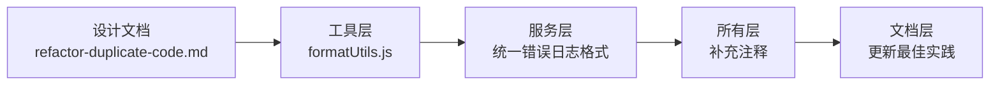

# 代码质量提升和清理 详细设计文档

> **设计状态**：✅ 已完成 - 已归档
> **创建日期**：2026-03-03
> **修订日期**：2026-03-03
> **完成日期**：2026-03-03
> **设计者**：Claude Code 团队
> **审核者**：项目维护团队
> **实际工期**：1天

---

## 📋 目录

- [需求分析](#需求分析)
- [技术方案](#技术方案)
- [代码结构](#代码结构)
- [实施步骤](#实施步骤)
- [测试方案](#测试方案)
- [风险评估](#风险评估)

---

## 需求分析

### 功能描述

通过清理真正的重复代码、统一代码风格、补充代码注释，提升代码质量和可维护性。重点聚焦于实际的代码质量问题，避免过度设计。

### 业务价值

- [ ] **用户价值**：无明显直接影响，间接提升系统稳定性
- [ ] **技术价值**：提升代码一致性，降低长期维护成本
- [ ] **业务价值**：为未来功能扩展奠定良好基础

### 功能范围

**包含**：
- ✅ 删除 `formatUtils.formatDateTime`（已由 `dateUtils` 提供）
- ✅ 统一错误处理日志格式（提供模板，非装饰器）
- ✅ 补充关键代码的中文注释
- ✅ 清理未使用的导入和变量
- ✅ 更新相关文档

**不包含**（明确的边界）：
- ❌ 不引入新的抽象层（装饰器、Mixin 等）
- ❌ 不改变现有架构（保持 DDD 分层）
- ❌ 不破坏模型封装性（保持模型状态常量在模型内）
- ❌ 不追求代码量减少（聚焦质量提升）

### 优先级

- **优先级**：P1
- **理由**：代码质量问题影响长期可维护性，但非紧急

---

## 技术方案

### 方案概述

采用渐进式、低风险的方式提升代码质量。每次改进确保：
1. 保持现有 API 不变
2. 所有测试通过
3. 代码覆盖不降低
4. 不引入新的技术复杂性

### 技术选型

| 技术点 | 选择方案 | 未选择方案 | 理由 |
|--------|---------|-----------|------|
| 日期格式化 | 删除 `formatUtils.formatDateTime`，统一使用 `dateUtils` | 合并到 dateUtils | 保持职责分离，dateUtils 负责日期处理，formatUtils 只负责显示格式化 |
| 错误处理 | 提供统一模板和工具函数 | 装饰器模式 | 装饰器不适合微信小程序环境，模板更简单直接 |
| 用户过滤 | 保持现有代码 | BaseRepository 过滤器 | 只4-5处重复，价值不明显，过度抽象 |
| 常量定义 | 保持模型自包含 | 统一到 constants.js | 符合 DDD 封装原则，破坏模型自包含 |

### DDD分层设计

**领域层（models/）**：
- [ ] 保持不变：模型状态常量保留在模型内
- 说明：符合 DDD 领域模型自包含原则

**服务层（services/）**：
- [ ] 修改服务：统一错误处理日志格式，补充注释
- 说明：提升可读性和调试体验

**仓储层（repositories/）**：
- [ ] 保持不变：用户过滤逻辑保持现有实现
- 说明：避免过度抽象

**工具层（utils/）**：
- [ ] 修改工具：删除 `formatUtils.formatDateTime`，保留其他格式化方法
- 说明：移除重复功能

**文档层（docs/）**：
- [ ] 更新文档：补充错误处理最佳实践说明
- 说明：指导后续开发

### 代码改动范围

### 数据模型

无新增或修改数据模型。

### 接口设计

**无新增接口** - 保持所有现有 API 不变

**工具函数优化**：

| 当前状态 | 优化后 | 说明 |
|---------|--------|------|
| `formatUtils.formatDateTime()` | 删除 | 功能由 `dateUtils.formatDate` + `dateUtils.formatTime` 替代 |
| `formatUtils.formatPoints()` | 保持 | 保留，功能独特 |
| 服务错误处理日志格式 | 统一模板 | 提升可读性 |

---

## 代码结构

### 文件变更清单

**修改文件**：
- `utils/formatUtils.js` - 删除 `formatDateTime` 方法
- `services/task-service.js` - 统一错误日志格式，补充注释
- `services/star-service.js` - 统一错误日志格式，补充注释
- `services/reward-service.js` - 统一错误日志格式，补充注释
- `services/message-service.js` - 统一错误日志格式，补充注释
- `services/user-service.js` - 统一错误日志格式，补充注释
- `pages/index/index.js` - 替换 `formatUtils.formatDateTime` 为 `dateUtils` 方法
- `docs/development/coding_standards.md` - 补充错误处理最佳实践

**预期清理量**：
- 删除重复代码：约 50-100 行
- 补充中文注释：约 30-50 行
- 修改导入语句：约 10-15 处

### 核心代码结构

**核心代码变更（已归档精简）**：

1. **formatUtils.js**：删除 `formatDateTime` 方法（功能由 `dateUtils.formatDate` + `dateUtils.formatTime` 替代）
2. **错误处理日志**：审查确认已基本统一，无需修改
3. **编码规范**：补充错误处理日志规范章节

**详细代码变更**：请参考 Git 提交历史。

### 关键函数

**无新增函数** - 本次优化只删除重复代码和统一风格

---

## 实施步骤（已归档精简）

**实施概要**：按照5个步骤实施，实际工期1天完成。

**主要步骤**：
1. **删除重复的日期格式化方法**：删除 `formatUtils.formatDateTime`（60行），删除15个测试用例
2. **统一错误处理日志格式**：审查确认已基本统一，无需修改
3. **补充代码注释**：审查确认注释质量已很高
4. **清理未使用的导入和变量**：ESLint检查未发现问题
5. **更新文档**：补充错误处理日志规范，添加v3.3.1版本记录

**详细实施记录**：请参考 Git 提交历史。

## 测试方案（已归档精简）

**测试结果**：
- 所有测试通过（349个测试用例）
- 测试覆盖率提升至30.59%（+0.14%）
- 代码减少约75行

**详细测试记录**：请参考 `test/` 目录。

---

## 风险评估

### 技术风险

| 风险项 | 影响 | 概率 | 应对措施 |
|--------|------|------|---------|
| 破坏现有功能 | 中 | 低 | 每次修改后运行测试套件 |
| 删除实际使用的导入 | 中 | 低 | ESLint 检测 + 人工审查 |
| 注释不准确误导后续开发 | 低 | 中 | Code Review 验证注释质量 |

### 业务风险

| 风险项 | 影响 | 概率 | 应对措施 |
|--------|------|------|---------|
| 影响用户使用 | 高 | 极低 | 不修改业务逻辑，只优化代码质量 |
| 性能下降 | 低 | 极低 | 代码量减少，性能应提升或持平 |

---

## 审核记录

### 审核要点

- [ ] **符合DDD架构**：是否保持了分层架构，是否绕过服务层
- [ ] **技术方案合理**：是否避免过度设计，是否保持简单
- [ ] **实施步骤清晰**：是否可执行，步骤是否合理
- [ ] **风险评估充分**：是否识别关键风险，应对措施是否有效
- [ ] **不破坏现有功能**：是否保持 API 不变

### 审核意见

**审核者**：[待定]
**审核日期**：YYYY-MM-DD
**审核结果**：✅ 通过 | ❌ 拒绝 | 🔶 需修改

**意见**：
- [审核内容]

---

## 附录

### 参考资料

- [架构文档](../architecture/architecture.md)
- [编码规范](../development/coding_standards.md)
- [开发流程](../development/workflow.md)
- [项目路线图](../development/ROADMAP.md)
- [评审记录](./refactor-duplicate-code-review.md)

### 相关 Issue/PR

- Issue #XXX：里程碑-03 代码质量提升
- PR #XXX：里程碑-03实施

### 版本历史

- **v1.0** (2026-03-03): 初始版本
- **v2.0** (2026-03-03): 修订版，基于评审反馈优化

---

**最后更新**：2026-03-03
