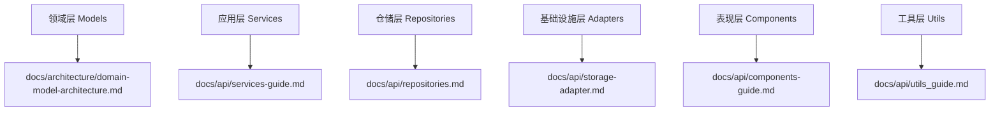

# 文档维护工作流

## 概述

本文档定义了学习任务微信小程序的文档维护工作流程，确保文档与代码保持同步，为开发团队提供准确、及时的技术文档。

## 文档维护原则

### 1. 同步更新原则
- **代码先行**：代码实现完成后立即更新文档
- **零滞后**：不允许文档更新滞后于代码发布
- **完整覆盖**：所有公共API都必须有对应文档

### 2. 质量保证原则
- **准确性**：文档内容必须与实际代码实现一致
- **可执行性**：示例代码必须能够直接运行
- **完整性**：包含完整的参数、返回值和错误处理说明

### 3. 用户友好原则
- **实用性**：提供实际开发中的使用场景
- **渐进性**：从基础用法到高级特性的渐进式介绍
- **可搜索性**：使用清晰的标题和关键词

## 文档结构与职责

### 文档分类

| 文档类型 | 位置 | 职责 | 更新频率 |
|---------|------|------|----------|
| API文档 | `docs/api/` | 详细的API使用说明 | 代码变更时 |
| 架构文档 | `docs/architecture/` | 系统设计和架构说明 | 架构调整时 |
| 开发文档 | `docs/development/` | 开发流程和规范 | 流程变更时 |
| 用户文档 | `docs/user/` | 用户使用指南 | 功能发布时 |

### DDD架构对应的文档



## 更新工作流

### 1. 新增功能时的文档流程

#### 步骤1：代码实现阶段
```javascript
// 在代码中添加完整的JSDoc注释
/**
 * 完成任务并分配星星奖励
 * @param {string} taskId - 任务ID
 * @param {string} userId - 用户ID
 * @returns {Promise<{success: boolean, starReward?: number, message?: string}>}
 * @throws {Error} 当任务不存在或用户无权限时抛出错误
 * @example
 * const result = await taskService.completeTask('task_123', 'child');
 * if (result.success) {
 *   console.log(`获得${result.starReward}颗星`);
 * }
 */
async completeTask(taskId, userId) {
  // 实现代码
}
```

#### 步骤2：更新对应API文档
根据代码所属层级更新相应文档：

- **服务层新增**：更新 `docs/api/services-guide.md`
- **仓储层新增**：更新 `docs/api/repositories.md`
- **组件新增**：更新 `docs/api/components-guide.md`
- **工具函数新增**：更新 `docs/api/utils_guide.md`

#### 步骤3：更新架构文档（如需要）
如果新功能涉及架构变更：
- 更新 `docs/architecture/system_architecture.md`
- 更新相关的流程图和架构图

#### 步骤4：提交代码
```bash
git commit -m "feat(TaskService): 添加completeTask方法并更新API文档

- 新增任务完成功能，支持星星奖励分配
- 更新services-guide.md中TaskService部分
- 添加完整的使用示例和错误处理说明"
```

### 2. 修改现有API时的文档流程

#### 步骤1：影响分析
```javascript
// 分析变更影响
const changeAnalysis = {
  breakingChange: true, // 是否为破坏性变更
  affectedFiles: [     // 受影响的文件
    'pages/index/index.js',
    'pages/tasks/tasks.js'
  ],
  migrationRequired: true // 是否需要迁移指南
};
```

#### 步骤2：更新文档
```markdown
## completeTask(taskId, userId, options) - v2.0

> ⚠️ **破坏性变更**：从v2.0开始，第三个参数`options`为必需参数

**变更说明**：
- v1.x: `completeTask(taskId, userId)`
- v2.0+: `completeTask(taskId, userId, options)`

**迁移指南**：
```javascript
// v1.x 用法
await taskService.completeTask('task_123', 'child');

// v2.0+ 用法
await taskService.completeTask('task_123', 'child', { 
  autoReward: true 
});
```

#### 步骤3：版本标记
在文档中添加版本信息：
```markdown
| 版本 | 变更内容 | 迁移指南 |
|------|----------|----------|
| v2.0 | 添加options参数 | [迁移指南](#migration-v2) |
| v1.0 | 初始版本 | - |
```

### 3. 废弃API时的文档流程

#### 步骤1：代码标记
```javascript
/**
 * @deprecated 从v3.0起废弃，请使用completeTaskWithReward()代替
 * @see completeTaskWithReward
 */
async completeTask(taskId, userId) {
  logger.warn('TaskService', 'completeTask方法已废弃，请使用completeTaskWithReward');
  return this.completeTaskWithReward(taskId, userId, { autoReward: true });
}
```

#### 步骤2：文档更新
```markdown
## ~~completeTask~~ (已废弃)

> ⚠️ **已废弃**：此方法从v3.0起废弃，将在v4.0中移除

**替代方案**：使用 `completeTaskWithReward()` 方法

**迁移示例**：
```javascript
// 废弃用法
await taskService.completeTask(taskId, userId);

// 推荐用法
await taskService.completeTaskWithReward(taskId, userId, { autoReward: true });
```
```

## 文档质量保证

### 1. 自动化检查

#### 文档链接检查
```bash
# 检查文档中的内部链接是否有效
npm run docs:check-links
```

#### 示例代码验证
```bash
# 提取并验证文档中的代码示例
npm run docs:validate-examples
```

### 2. 人工审查清单

#### 内容审查
- [ ] API签名是否正确
- [ ] 参数类型和说明是否完整
- [ ] 返回值说明是否准确
- [ ] 错误处理是否有说明
- [ ] 示例代码是否可运行

#### 格式审查
- [ ] Markdown格式是否正确
- [ ] 代码块语法高亮是否正确
- [ ] 表格格式是否规范
- [ ] 链接是否有效

#### 架构一致性审查
- [ ] 是否符合DDD分层原则
- [ ] 服务调用方式是否正确
- [ ] 错误处理模式是否一致

### 3. 定期维护

#### 季度文档审计
```javascript
// 文档审计检查项
const auditChecklist = {
  apiCoverage: '检查所有公共API是否有文档',
  exampleValidity: '验证所有示例代码是否可运行',
  linkIntegrity: '检查所有内部和外部链接',
  versionConsistency: '确保版本信息一致',
  architectureAlignment: '确保文档与当前架构一致'
};
```

#### 文档性能监控
- 跟踪文档访问频率
- 收集开发者反馈
- 识别需要改进的文档部分

## 文档模板

### 服务层API模板

```markdown
### ServiceName.methodName(param1, param2)

**描述**：方法功能的简要说明

**参数**：
- `param1` *{Type}* - 参数1的详细说明
- `param2` *{Type}* - 参数2的详细说明

**返回值**：
- `Promise<{success: boolean, data?: any, message?: string}>` - 标准服务响应格式

**错误处理**：
- 抛出 `ValidationError` 当参数验证失败时
- 抛出 `NotFoundError` 当资源不存在时

**使用示例**：
```javascript
// 基础用法
const result = await serviceManager.get('serviceName').methodName(param1, param2);

if (result.success) {
  console.log('操作成功:', result.data);
} else {
  console.error('操作失败:', result.message);
}

// 错误处理
try {
  const result = await serviceManager.get('serviceName').methodName(param1, param2);
  // 处理结果
} catch (error) {
  logger.error('ServiceName', '方法调用失败', error);
  // 错误处理逻辑
}
```

**相关方法**：
- [relatedMethod1](#relatedmethod1) - 相关方法说明
- [relatedMethod2](#relatedmethod2) - 相关方法说明
```

### 组件API模板

```markdown
### ComponentName

**文件路径**：`components/componentName/componentName.js`

**描述**：组件的功能和用途说明

**属性**：
| 属性名 | 类型 | 默认值 | 必需 | 说明 |
|--------|------|--------|------|------|
| prop1 | String | '' | 是 | 属性1的说明 |
| prop2 | Number | 0 | 否 | 属性2的说明 |

**事件**：
| 事件名 | 参数 | 说明 |
|--------|------|------|
| tap | { detail: Object } | 点击时触发 |
| change | { detail: { value } } | 值改变时触发 |

**插槽**：
- **default** - 默认内容区域
- **header** - 头部区域
- **footer** - 底部区域

**使用示例**：
```html
<!-- 页面JSON配置 -->
{
  "usingComponents": {
    "component-name": "/components/componentName/componentName"
  }
}

<!-- 页面WXML使用 -->
<component-name 
  prop1="value1"
  prop2="{{numberValue}}"
  bind:tap="onComponentTap"
  bind:change="onComponentChange">
  
  <view slot="header">头部内容</view>
  <view>默认内容</view>
  <view slot="footer">底部内容</view>
</component-name>
```

```javascript
// 页面JS处理
Page({
  data: {
    numberValue: 42
  },
  
  onComponentTap(e) {
    console.log('组件被点击:', e.detail);
  },
  
  onComponentChange(e) {
    console.log('组件值改变:', e.detail.value);
  }
});
```
```

## 工具和自动化

### 1. 文档生成工具

```javascript
// scripts/generate-docs.js
const generateApiDocs = {
  extractJSDoc: '从代码中提取JSDoc注释',
  generateMarkdown: '生成Markdown格式的API文档',
  validateExamples: '验证示例代码的正确性',
  updateIndex: '更新文档索引和导航'
};
```

### 2. 持续集成

```yaml
# .github/workflows/docs.yml
name: Documentation
on: [push, pull_request]
jobs:
  docs-check:
    runs-on: ubuntu-latest
    steps:
      - uses: actions/checkout@v2
      - name: Check documentation
        run: |
          npm run docs:check-links
          npm run docs:validate-examples
          npm run docs:spell-check
```

### 3. 开发工具集成

```json
// .vscode/settings.json
{
  "markdown.extension.toc.updateOnSave": true,
  "markdown.extension.preview.autoShowPreviewToSide": true,
  "cSpell.words": ["TaskService", "StarService", "RewardService"]
}
```

## 最佳实践

### 1. 编写高质量文档

```markdown
<!-- ✅ 好的文档示例 -->
### completeTask(taskId, userId)

完成指定任务并为用户分配星星奖励。

**参数**：
- `taskId` *{string}* - 任务的唯一标识符
- `userId` *{string}* - 用户ID，支持'child'和'parent'

**返回值**：
- `Promise<{success: boolean, starReward: number, message: string}>` 

**示例**：
```javascript
const result = await taskService.completeTask('task_123', 'child');
if (result.success) {
  wx.showToast({ title: `获得${result.starReward}颗星！` });
}
```

<!-- ❌ 避免的文档示例 -->
### completeTask
完成任务
```

### 2. 保持文档同步

```javascript
// ✅ 推荐：在代码变更时立即更新文档
const updateWorkflow = {
  step1: '修改代码实现',
  step2: '更新JSDoc注释',
  step3: '更新API文档',
  step4: '验证示例代码',
  step5: '提交代码和文档'
};

// ❌ 避免：文档更新滞后
const badWorkflow = {
  step1: '修改代码实现',
  step2: '提交代码',
  step3: '稍后更新文档' // 容易被遗忘
};
```

### 3. 用户导向的文档

```markdown
<!-- ✅ 以用户场景为导向 -->
## 如何完成一个任务

当用户完成学习任务时，系统需要：
1. 验证任务状态
2. 分配星星奖励
3. 更新用户进度
4. 发送完成通知

```javascript
// 完整的任务完成流程
async function handleTaskCompletion(taskId) {
  try {
    const result = await taskService.completeTask(taskId, 'child');
    
    if (result.success) {
      // 显示成功消息
      wx.showToast({ title: `任务完成！获得${result.starReward}颗星` });
      
      // 刷新页面数据
      this.refreshTaskList();
    }
  } catch (error) {
    // 错误处理
    wx.showToast({ title: '完成失败，请重试', icon: 'error' });
  }
}
```

<!-- ❌ 避免：纯技术性描述 -->
## completeTask方法
该方法用于完成任务，参数包括taskId和userId...
```

---

**文档维护者**：开发团队  
**最后更新**：2024年12月  
**版本**：v3.0 